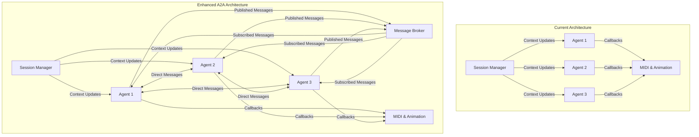
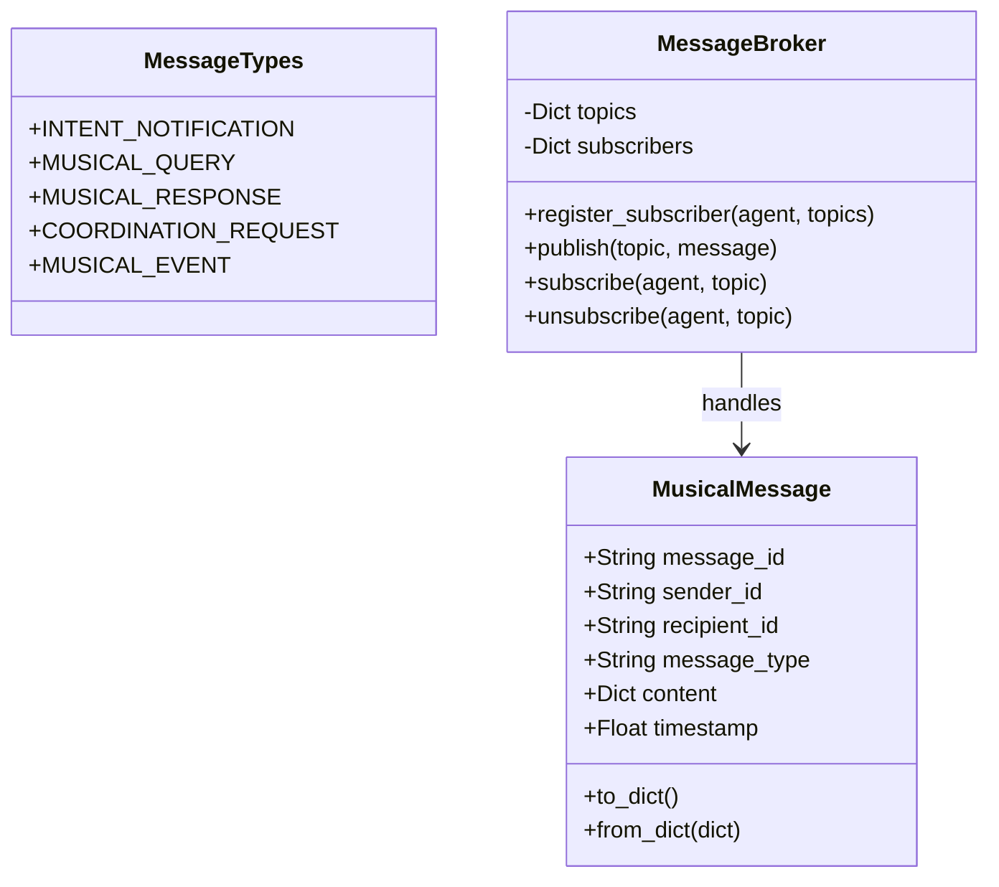
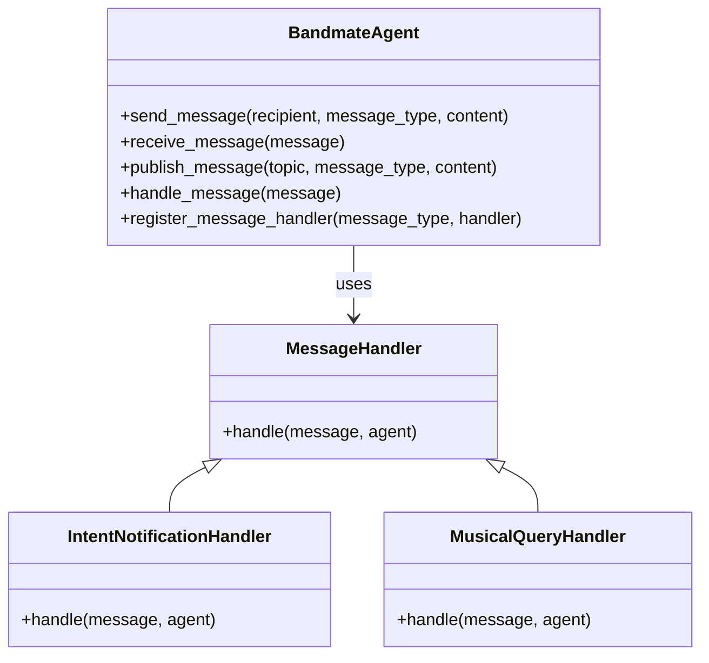
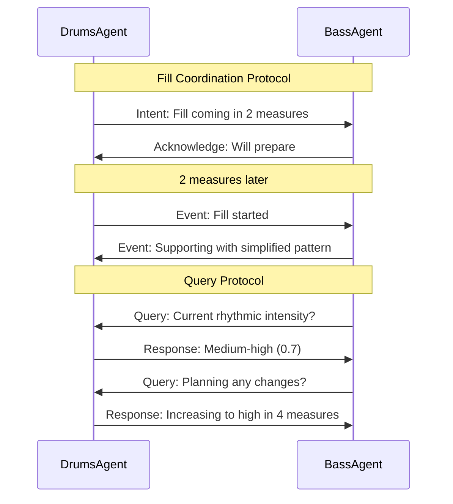
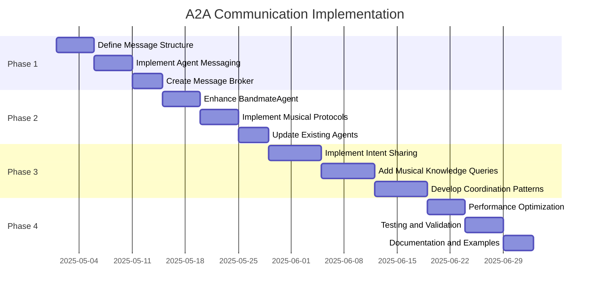

# Implementation Plan: A2A Communication Protocols for Performance Suite

Based on our analysis of Google's A2A framework and the current agent system, this plan outlines a comprehensive approach to integrate A2A-style communication protocols into the Performance Suite, building on the existing architecture while introducing powerful new agent interaction capabilities.

## 1. System Architecture Overview



The enhanced architecture maintains the existing SessionManager for timing and global context while adding:
1. Direct agent-to-agent messaging
2. A message broker for publish-subscribe patterns
3. Structured message formats for musical communication

## 2. Core Components

### 2.1 Message System



### 2.2 Enhanced Agent Interface



### 2.3 Musical Conversation Protocols



## 3. Implementation Phases

### Phase 1: Core Message Infrastructure (2 weeks)

1. **Define Message Structure**
   - Create `MusicalMessage` class
   - Define standard message types
   - Implement serialization/deserialization

2. **Implement Basic Agent Messaging**
   - Add messaging methods to `BandmateAgent`
   - Create message handling framework
   - Implement direct agent-to-agent messaging

3. **Create Message Broker**
   - Implement publish-subscribe system
   - Create topic management
   - Add broker to SessionManager

### Phase 2: Agent Communication Capabilities (2 weeks)

1. **Enhance BandmateAgent**
   - Add message handling capabilities
   - Implement standard message handlers
   - Create agent discovery mechanism

2. **Implement Musical Protocols**
   - Define standard conversation patterns
   - Implement fill coordination protocol
   - Implement query-response protocol

3. **Update Existing Agents**
   - Enhance DrumsAgent with messaging
   - Enhance BassAgent with messaging
   - Create initial agent interactions

### Phase 3: Advanced Musical Interactions (3 weeks)

1. **Implement Intent Sharing**
   - Add future musical intent capabilities
   - Create intent notification system
   - Implement intent-based responses

2. **Add Musical Knowledge Queries**
   - Implement musical knowledge representation
   - Create query-response system
   - Add agent-specific knowledge

3. **Develop Coordination Patterns**
   - Implement section transition coordination
   - Add dynamic role assignment
   - Create ensemble awareness

### Phase 4: Integration and Optimization (2 weeks)

1. **Performance Optimization**
   - Optimize message handling
   - Implement message prioritization
   - Ensure real-time performance

2. **Testing and Validation**
   - Create automated tests for messaging
   - Validate musical interactions
   - Measure system performance

3. **Documentation and Examples**
   - Document messaging system
   - Create example agent interactions
   - Provide extension guidelines

## 4. Detailed Implementation Tasks

### 4.1 Core Message System

```python
# Example implementation of MusicalMessage
class MusicalMessage:
    def __init__(self, sender_id, recipient_id=None, message_type=None, content=None):
        self.message_id = str(uuid.uuid4())
        self.sender_id = sender_id
        self.recipient_id = recipient_id  # None for broadcast
        self.message_type = message_type
        self.content = content or {}
        self.timestamp = time.time()
    
    def to_dict(self):
        return {
            'message_id': self.message_id,
            'sender_id': self.sender_id,
            'recipient_id': self.recipient_id,
            'message_type': self.message_type,
            'content': self.content,
            'timestamp': self.timestamp
        }
    
    @classmethod
    def from_dict(cls, data):
        msg = cls(data['sender_id'])
        msg.message_id = data['message_id']
        msg.recipient_id = data['recipient_id']
        msg.message_type = data['message_type']
        msg.content = data['content']
        msg.timestamp = data['timestamp']
        return msg
```

### 4.2 Message Broker

```python
# Example implementation of MessageBroker
class MessageBroker:
    def __init__(self):
        self.topics = {}  # topic -> list of messages
        self.subscribers = {}  # topic -> list of agents
    
    def publish(self, topic, message):
        if topic not in self.topics:
            self.topics[topic] = []
        
        self.topics[topic].append(message)
        
        # Notify subscribers
        if topic in self.subscribers:
            for agent in self.subscribers[topic]:
                agent.receive_message(message)
    
    def subscribe(self, agent, topic):
        if topic not in self.subscribers:
            self.subscribers[topic] = []
        
        self.subscribers[topic].append(agent)
    
    def unsubscribe(self, agent, topic):
        if topic in self.subscribers and agent in self.subscribers[topic]:
            self.subscribers[topic].remove(agent)
```

### 4.3 Enhanced BandmateAgent

```python
# Example enhancements to BandmateAgent
class BandmateAgent(abc.ABC):
    # ... existing code ...
    
    def __init__(self, agent_type, responsiveness=0.7):
        # ... existing initialization ...
        self.message_handlers = {}
        self.agent_id = str(uuid.uuid4())
    
    def send_message(self, recipient_id, message_type, content):
        message = MusicalMessage(
            sender_id=self.agent_id,
            recipient_id=recipient_id,
            message_type=message_type,
            content=content
        )
        # Delivery mechanism will be injected by SessionManager
        if hasattr(self, '_message_delivery_func'):
            self._message_delivery_func(message)
    
    def receive_message(self, message):
        # Handle incoming message
        if message.message_type in self.message_handlers:
            self.message_handlers[message.message_type](message)
        else:
            self.handle_message(message)
    
    def handle_message(self, message):
        # Default message handling
        pass
    
    def register_message_handler(self, message_type, handler):
        self.message_handlers[message_type] = handler
    
    def publish_message(self, topic, message_type, content):
        message = MusicalMessage(
            sender_id=self.agent_id,
            recipient_id=None,  # Broadcast
            message_type=message_type,
            content=content
        )
        # Publishing mechanism will be injected by SessionManager
        if hasattr(self, '_message_publish_func'):
            self._message_publish_func(topic, message)
```

### 4.4 SessionManager Enhancements

```python
# Example enhancements to SessionManager
class SessionManager:
    # ... existing code ...
    
    def __init__(self, update_rate=30.0):
        # ... existing initialization ...
        self.message_broker = MessageBroker()
        self.agent_directory = {}  # agent_id -> agent
    
    def register_agent(self, agent):
        # ... existing code ...
        
        # Register with directory
        self.agent_directory[agent.agent_id] = agent
        
        # Inject message delivery function
        agent._message_delivery_func = self._deliver_message
        agent._message_publish_func = self.message_broker.publish
    
    def _deliver_message(self, message):
        if message.recipient_id:
            # Direct message
            if message.recipient_id in self.agent_directory:
                recipient = self.agent_directory[message.recipient_id]
                recipient.receive_message(message)
        else:
            # Broadcast message
            for agent_id, agent in self.agent_directory.items():
                if agent_id != message.sender_id:
                    agent.receive_message(message)
```

## 5. Musical Interaction Examples

### 5.1 Fill Coordination

```python
# DrumsAgent enhancement
class DrumsAgent(BandmateAgent):
    # ... existing code ...
    
    def __init__(self, responsiveness=0.7):
        super().__init__("drums", responsiveness)
        self.register_message_handler("intent_query", self.handle_intent_query)
        self.upcoming_fills = []
    
    def _should_generate_notes(self):
        # ... existing code ...
        
        # Check if we should plan a fill
        if self.context and self.context.is_playing:
            current_bar = self.context.bar_position
            beat_in_bar = self.context.beat_position
            
            # Plan fills at regular intervals
            if current_bar % 4 == 3 and beat_in_bar > 3.0:
                self._plan_fill(current_bar + 1)
        
        return super()._should_generate_notes()
    
    def _plan_fill(self, target_bar):
        # Check if we already planned this fill
        for fill in self.upcoming_fills:
            if fill["bar"] == target_bar:
                return
        
        # Plan the fill
        fill_info = {
            "bar": target_bar,
            "intensity": random.uniform(0.5, 1.0),
            "planned_at": self.context.bar_position
        }
        
        self.upcoming_fills.append(fill_info)
        
        # Notify other agents
        for agent in self.session.agents:
            if agent.agent_type != "drums":
                self.send_message(
                    recipient_id=agent.agent_id,
                    message_type="fill_intent",
                    content={
                        "target_bar": target_bar,
                        "intensity": fill_info["intensity"]
                    }
                )
    
    def handle_intent_query(self, message):
        # Respond with our upcoming musical intentions
        response_content = {
            "upcoming_fills": self.upcoming_fills
        }
        
        self.send_message(
            recipient_id=message.sender_id,
            message_type="intent_response",
            content=response_content
        )
```

### 5.2 Bass Response to Fills

```python
# BassAgent enhancement
class BassAgent(BandmateAgent):
    # ... existing code ...
    
    def __init__(self, responsiveness=0.8):
        super().__init__("bass", responsiveness)
        self.register_message_handler("fill_intent", self.handle_fill_intent)
        self.expected_fills = []
    
    def handle_fill_intent(self, message):
        # Store the expected fill
        fill_info = {
            "target_bar": message.content["target_bar"],
            "intensity": message.content["intensity"],
            "sender_id": message.sender_id
        }
        
        self.expected_fills.append(fill_info)
        
        # Acknowledge receipt
        self.send_message(
            recipient_id=message.sender_id,
            message_type="fill_acknowledgment",
            content={
                "target_bar": fill_info["target_bar"],
                "response": "will_simplify" if fill_info["intensity"] > 0.7 else "will_complement"
            }
        )
    
    def generate_notes(self):
        # ... existing code ...
        
        # Modify notes based on expected fills
        if self.context:
            current_bar = self.context.bar_position
            
            # Check if we're in a bar with an expected fill
            for fill in self.expected_fills[:]:
                if fill["target_bar"] == current_bar:
                    # Modify our pattern based on fill intensity
                    if fill["intensity"] > 0.7:
                        # For intense fills, simplify our pattern
                        notes = self._simplify_pattern(notes)
                    else:
                        # For lighter fills, complement the pattern
                        notes = self._complement_pattern(notes)
                    
                    # Remove processed fill
                    self.expected_fills.remove(fill)
                    break
        
        return notes
    
    def _simplify_pattern(self, notes):
        # Simplify the bass pattern to make room for an intense drum fill
        simplified = []
        for note in notes:
            # Keep only root notes or reduce velocity
            if "scale_degree" in note and note["scale_degree"] == 0:
                simplified.append(note)
            else:
                # Reduce velocity for non-root notes
                modified = note.copy()
                modified["velocity"] = int(note["velocity"] * 0.7)
                simplified.append(modified)
        
        return simplified
    
    def _complement_pattern(self, notes):
        # Complement a lighter drum fill with supportive bass notes
        # This could add rhythmic elements that work with the fill
        return notes  # Placeholder implementation
```

## 6. Testing and Validation

### 6.1 Unit Tests

Create unit tests for:
- Message creation and serialization
- Message broker functionality
- Agent message handling

### 6.2 Integration Tests

Create integration tests for:
- End-to-end message delivery
- Multi-agent conversations
- Musical protocol execution

### 6.3 Musical Validation

Develop tests to validate:
- Musical coherence of agent interactions
- Timing accuracy of coordinated actions
- Appropriate musical responses to messages

## 7. Performance Considerations

1. **Message Prioritization**
   - Prioritize time-sensitive messages
   - Defer non-critical messages during high CPU load
   - Implement message expiration for outdated content

2. **Efficient Message Routing**
   - Use direct routing for targeted messages
   - Optimize broadcast messages
   - Implement message batching where appropriate

3. **Real-time Constraints**
   - Ensure message handling respects timing requirements
   - Implement timeout mechanisms for responses
   - Monitor and log message latency

## 8. Implementation Roadmap



## 9. Success Metrics

1. **Technical Metrics**
   - Message delivery latency < 5ms
   - CPU overhead < 10% compared to current system
   - Memory overhead < 20MB

2. **Musical Metrics**
   - Increased musical coherence between agents
   - More varied and interesting musical interactions
   - Improved responsiveness to musical events

3. **Development Metrics**
   - Reduced code complexity for new agent interactions
   - Easier addition of new agent types
   - More maintainable agent behavior code