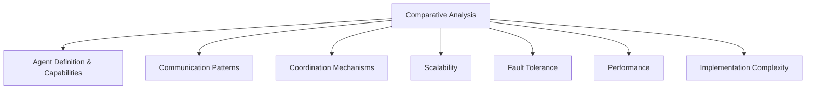
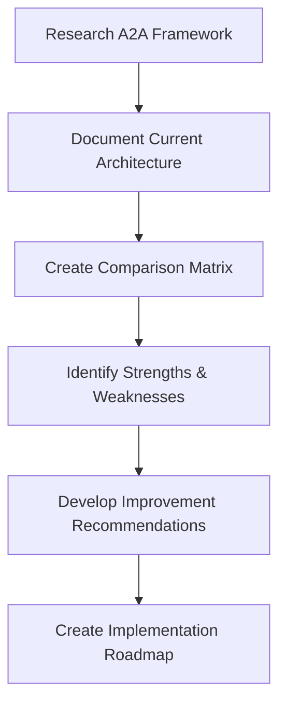
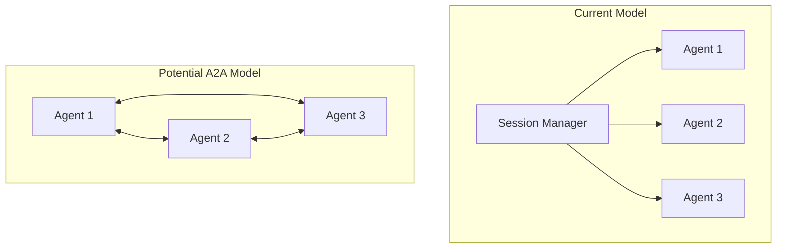

# Comparative Analysis Plan: Current Agent System vs. Google A2A Framework

## 1. Understanding the Current Architecture

From the code review, the current agent system has these key components:

- **SessionManager**: Central coordinator that maintains musical context and coordinates bandmate agents
- **MusicalContext**: Container for musical state (tempo, key, chord progression, etc.)
- **BandmateAgent**: Abstract base class for AI bandmate agents
- **Specialized Agents**: Concrete implementations like DrumsAgent and BassAgent
- **Communication Pattern**: Primarily hub-and-spoke with SessionManager as the hub

The system follows a centralized coordination model where:
1. Audio input is processed by AudioAnalyzer
2. SessionManager updates the MusicalContext
3. Agents receive context updates and generate musical output
4. Output is sent to MIDI generation and animation control

## 2. Understanding Google's A2A Framework

We'll need to research and document the key aspects of Google's A2A framework:

1. **Core Architecture**:
   - Agent definition and capabilities
   - Communication protocols
   - Coordination mechanisms

2. **Key Features**:
   - Agent specialization approach
   - Inter-agent communication patterns
   - Scalability mechanisms
   - Error handling and resilience

3. **Implementation Patterns**:
   - How agents are defined and instantiated
   - How communication is structured
   - How coordination is managed

## 3. Comparative Analysis Framework

We'll analyze both systems across these dimensions:

### 3.1 Agent Definition & Capabilities
- How agents are defined and what capabilities they have
- How specialized behaviors are implemented
- How agent state is managed

### 3.2 Communication Patterns
- Direct vs. mediated communication
- Synchronous vs. asynchronous patterns
- Message formats and protocols

### 3.3 Coordination Mechanisms
- Centralized vs. decentralized coordination
- How conflicts are resolved
- How global state is maintained

### 3.4 Scalability
- How the system handles increasing numbers of agents
- Performance implications of scaling
- Resource utilization patterns

### 3.5 Fault Tolerance
- How the system handles agent failures
- Recovery mechanisms
- Graceful degradation capabilities

### 3.6 Performance
- Latency characteristics
- Throughput capabilities
- Resource utilization

### 3.7 Implementation Complexity
- Development effort required
- Maintenance considerations
- Learning curve

## 4. Detailed Analysis Process

### 4.1 Research A2A Framework
- Review official documentation at https://google.github.io/A2A/
- Study code examples and reference implementations
- Understand design principles and patterns

### 4.2 Document Current Architecture
- Create detailed architecture diagrams
- Document communication patterns
- Analyze current limitations and strengths

### 4.3 Create Comparison Matrix
- Develop a detailed comparison across all dimensions
- Rate each approach on key metrics
- Identify gaps and overlaps

### 4.4 Identify Strengths & Weaknesses
- Determine where each approach excels
- Identify limitations in current implementation
- Highlight A2A features that could address current limitations

### 4.5 Develop Improvement Recommendations
- Specific recommendations for enhancing current architecture
- Prioritize improvements based on impact and effort
- Consider hybrid approaches that combine best elements

### 4.6 Create Implementation Roadmap
- Phased approach to implementing improvements
- Testing strategy for validating changes
- Migration path that minimizes disruption

## 5. Specific Areas to Explore in A2A

Based on the current implementation, these A2A aspects may be particularly relevant:

### 5.1 Agent Communication Protocols
How A2A handles agent-to-agent communication compared to the current hub-and-spoke model.

### 5.2 Agent Specialization
How A2A approaches specialized agent capabilities compared to the inheritance-based model.

### 5.3 Context Sharing
How A2A manages shared context compared to the centralized MusicalContext.

### 5.4 Scaling to More Complex Agents
How A2A supports more sophisticated agent behaviors and interactions.

## 6. Deliverables

1. **Comprehensive Analysis Document**:
   - Detailed comparison of both architectures
   - Strengths and weaknesses analysis
   - Specific improvement recommendations

2. **Architecture Enhancement Plan**:
   - Prioritized list of improvements
   - Implementation approach for each improvement
   - Testing and validation strategy

3. **Proof of Concept Implementation**:
   - Small-scale implementation of key A2A concepts
   - Performance and functionality comparison
   - Lessons learned and recommendations

## 7. Timeline and Milestones

1. **Research Phase** (1-2 weeks):
   - Deep dive into A2A documentation
   - Document current architecture in detail
   - Develop comparison framework

2. **Analysis Phase** (1-2 weeks):
   - Complete comparative analysis
   - Identify improvement opportunities
   - Develop initial recommendations

3. **Planning Phase** (1 week):
   - Finalize improvement recommendations
   - Develop implementation roadmap
   - Create testing and validation strategy

4. **Proof of Concept Phase** (2-3 weeks):
   - Implement key improvements
   - Test and validate changes
   - Document results and lessons learned

5. **Final Recommendations** (1 week):
   - Finalize architecture enhancement plan
   - Present findings and recommendations
   - Develop long-term roadmap

## 8. Key Questions to Answer

1. How does A2A's approach to agent communication compare to our current model?
2. What scalability advantages might A2A offer for more complex musical interactions?
3. How does A2A handle real-time constraints compared to our current approach?
4. What would be the implementation complexity of adopting A2A patterns?
5. Could we adopt specific A2A concepts without a complete architecture overhaul?