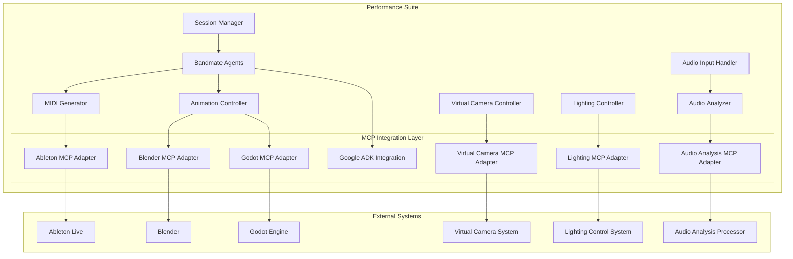

# Expanded MCP Integration Opportunities

This document outlines additional opportunities for MCP server integration in the Performance Suite project, beyond the initially identified Blender MCP, Ableton MCP, and Google ADK integrations.

## Additional MCP Server Opportunities

### 1. Godot Game Engine MCP Server

The Godot game engine MCP server could be integrated to provide an alternative or complementary rendering pipeline to the Blender MCP server.

#### Benefits:
- Real-time 2D/3D rendering capabilities
- Cross-platform deployment options
- Lower resource requirements compared to Blender for certain visualization types
- Potential for interactive audience experiences

#### Integration Points:
- Create a `GodotMCPAdapter` class similar to the `BlenderMCPAdapter`
- Implement animation mapping for Godot-specific features
- Add support for interactive elements and audience participation
- Enable seamless switching between Blender and Godot rendering based on performance needs

#### Implementation Plan:
1. **Setup Phase**:
   - Configure Godot MCP server
   - Define connection parameters and authentication
   - Create directory structure for Godot MCP integration

2. **Core Integration**:
   - Implement `GodotMCPAdapter` class
   - Create animation mapping for Godot
   - Integrate with `AnimationController`
   - Implement fallback mechanisms

3. **Advanced Features**:
   - Add support for audience interaction
   - Implement real-time visualization customization
   - Create performance-specific visual effects

### 2. Audio Analysis MCP Server

The audio analysis component could benefit from an MCP server dedicated to advanced audio processing and feature extraction.

#### Benefits:
- More sophisticated audio analysis capabilities
- Access to pre-trained models for chord detection, beat tracking, etc.
- Offloading computationally intensive processing
- Potential for more accurate musical feature extraction

#### Integration Points:
- Create an `AudioAnalysisMCPAdapter` class
- Modify the `AudioAnalyzer` class to use the MCP server when available
- Implement local fallback for when the MCP server is unavailable
- Add support for advanced features like style detection, genre classification, etc.

#### Implementation Plan:
1. **Setup Phase**:
   - Configure Audio Analysis MCP server
   - Define connection parameters and authentication
   - Create directory structure for Audio Analysis MCP integration

2. **Core Integration**:
   - Implement `AudioAnalysisMCPAdapter` class
   - Modify `AudioAnalyzer` to use MCP server
   - Implement fallback to local processing
   - Add caching mechanisms for performance optimization

3. **Advanced Features**:
   - Implement style and genre detection
   - Add harmonic analysis capabilities
   - Support for multi-instrument separation and analysis

### 3. Virtual Camera MCP Server

A Virtual Camera MCP server could be integrated to provide advanced camera control and cinematography for performances.

#### Benefits:
- Dynamic camera movements based on musical features
- Automated cinematography that follows the performance
- Multiple camera angles and transitions
- Professional-looking video output for streaming or recording

#### Integration Points:
- Create a `VirtualCameraMCPAdapter` class
- Implement camera control based on musical context
- Add support for predefined camera sequences for different sections
- Integrate with the animation controller for coordinated visuals

#### Implementation Plan:
1. **Setup Phase**:
   - Configure Virtual Camera MCP server
   - Define connection parameters and authentication
   - Create directory structure for Virtual Camera MCP integration

2. **Core Integration**:
   - Implement `VirtualCameraMCPAdapter` class
   - Create camera movement mapping based on musical features
   - Integrate with session manager for section awareness
   - Implement fallback mechanisms

3. **Advanced Features**:
   - Add support for multiple camera presets
   - Implement intelligent shot selection based on performance
   - Create smooth transitions between camera angles

### 4. Lighting Control MCP Server

A Lighting Control MCP server could be integrated to manage DMX lighting systems for live performances.

#### Benefits:
- Synchronized lighting effects with the music
- Dynamic lighting changes based on musical features
- Support for various DMX-compatible lighting systems
- Enhanced visual experience for live performances

#### Integration Points:
- Create a `LightingMCPAdapter` class
- Implement lighting control based on musical context
- Add support for predefined lighting scenes for different sections
- Integrate with the session manager for coordinated lighting changes

#### Implementation Plan:
1. **Setup Phase**:
   - Configure Lighting Control MCP server
   - Define connection parameters and authentication
   - Create directory structure for Lighting MCP integration

2. **Core Integration**:
   - Implement `LightingMCPAdapter` class
   - Create lighting mapping based on musical features
   - Integrate with session manager for section awareness
   - Implement fallback mechanisms

3. **Advanced Features**:
   - Add support for multiple lighting rigs
   - Implement intelligent lighting design based on performance
   - Create smooth transitions between lighting scenes

## Updated System Architecture

With these additional MCP servers, the system architecture would be expanded as follows:



## Implementation Strategy

The implementation strategy for these additional MCP servers would follow the same hybrid approach as the core MCP integration:

1. **Adapter Pattern**: Each MCP server has its own adapter class that implements a common interface
2. **Performance Optimization**: Critical paths are optimized for low-latency communication
3. **Fallback Mechanisms**: Local implementations are available when MCP servers are unavailable

## Phased Implementation

To manage the complexity of integrating multiple MCP servers, we recommend a phased approach:

1. **Phase 1**: Implement the core MCP servers (Blender, Ableton, Google ADK)
2. **Phase 2**: Implement the Godot MCP server as an alternative rendering option
3. **Phase 3**: Implement the Audio Analysis MCP server for enhanced audio processing
4. **Phase 4**: Implement the Virtual Camera and Lighting MCP servers for advanced performance features

## Directory Structure

The expanded MCP integration would add the following structure to the project:

```
src/
├── mcp_integration/
│   ├── __init__.py
│   ├── common/
│   │   ├── __init__.py
│   │   ├── interfaces.py
│   │   ├── connection_manager.py
│   │   └── error_handling.py
│   ├── blender/
│   │   ├── __init__.py
│   │   ├── blender_mcp_adapter.py
│   │   ├── animation_mapping.py
│   │   └── fallback_renderer.py
│   ├── ableton/
│   │   ├── __init__.py
│   │   ├── ableton_mcp_adapter.py
│   │   ├── midi_mapping.py
│   │   └── fallback_midi.py
│   ├── google_adk/
│   │   ├── __init__.py
│   │   ├── adk_manager.py
│   │   ├── agent_factory.py
│   │   └── communication.py
│   ├── godot/
│   │   ├── __init__.py
│   │   ├── godot_mcp_adapter.py
│   │   ├── scene_mapping.py
│   │   └── fallback_renderer.py
│   ├── audio_analysis/
│   │   ├── __init__.py
│   │   ├── audio_analysis_mcp_adapter.py
│   │   ├── feature_mapping.py
│   │   └── fallback_analyzer.py
│   ├── virtual_camera/
│   │   ├── __init__.py
│   │   ├── virtual_camera_mcp_adapter.py
│   │   ├── camera_mapping.py
│   │   └── fallback_camera.py
│   └── lighting/
│       ├── __init__.py
│       ├── lighting_mcp_adapter.py
│       ├── lighting_mapping.py
│       └── fallback_lighting.py
```

## Conclusion

Expanding the MCP integration to include these additional servers would significantly enhance the capabilities of the Performance Suite, providing more sophisticated audio analysis, alternative rendering options, and advanced performance features like virtual camera control and lighting. The modular architecture allows for incremental implementation, with each MCP server adding value independently while contributing to the overall system.