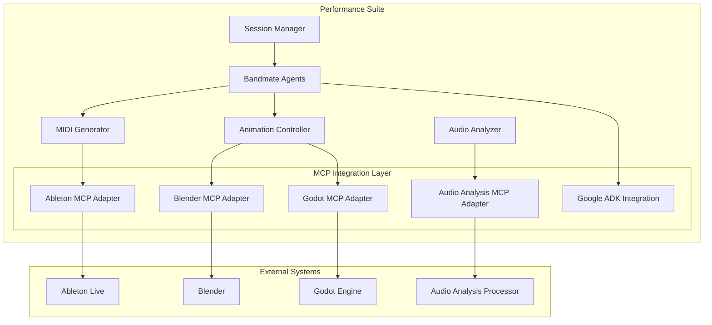

# Performance Suite MCP Integration Plan

## System Architecture Overview



## Core MCP Servers

This plan focuses on the integration of the following MCP servers:

1. **Blender MCP Server (blender-dynamic-mcp-vxai)** - For 3D modeling and animation control
2. **Ableton MCP Server (ableton-copilot-mcp)** - For audio processing and MIDI generation
3. **Google ADK (Agent Development Kit)** - For implementing bandmate agents
4. **Godot MCP Server** - For alternative 2D/3D rendering and interactive visualizations
5. **Audio Analysis MCP Server** - For enhanced audio feature extraction

For additional MCP integration opportunities, see [Expanded MCP Integration Opportunities](./mcp_integration_expanded.md).

## Phase 1: Setup and Configuration

### 1.1 MCP Server Configuration
- **Task 1.1.1**: Set up Blender MCP Server configuration
  - Create configuration files for Blender MCP server
  - Define connection parameters and authentication
  - Implement health check mechanism

- **Task 1.1.2**: Set up Ableton MCP Server configuration
  - Create configuration files for Ableton MCP server
  - Define connection parameters and authentication
  - Implement health check mechanism

- **Task 1.1.3**: Set up Google ADK environment
  - Install Google ADK dependencies
  - Configure authentication and API access
  - Set up development environment for agent creation

- **Task 1.1.4**: Set up Godot MCP Server configuration
  - Create configuration files for Godot MCP server
  - Define connection parameters and authentication
  - Implement health check mechanism

- **Task 1.1.5**: Set up Audio Analysis MCP Server configuration
  - Create configuration files for Audio Analysis MCP server
  - Define connection parameters and authentication
  - Implement health check mechanism

### 1.2 Project Structure Updates
- **Task 1.2.1**: Create MCP integration directory structure
  - Add `src/mcp_integration/` directory
  - Create subdirectories for each MCP server
  - Set up common interfaces and utilities

- **Task 1.2.2**: Update project dependencies
  - Add MCP server client libraries to requirements.txt
  - Add Google ADK dependencies
  - Update setup.py with new dependencies

### 1.3 Testing Infrastructure
- **Task 1.3.1**: Set up testing framework for MCP integration
  - Create mock MCP servers for testing
  - Implement test utilities for MCP communication
  - Set up CI/CD pipeline for MCP integration tests

## Phase 2: Core Integration

### 2.1 Blender MCP Integration
- **Task 2.1.1**: Create Blender MCP adapter class
  - Implement `BlenderMCPAdapter` class
  - Define interface for animation control
  - Implement connection management and error handling

- **Task 2.1.2**: Integrate with Animation Controller
  - Update `AnimationController` to use Blender MCP adapter
  - Implement translation of animation commands to MCP format
  - Add fallback mechanism for when Blender MCP is unavailable

- **Task 2.1.3**: Implement avatar animation control
  - Create mapping between musical events and animation triggers
  - Implement real-time animation parameter control
  - Add support for different avatar types and instruments

### 2.2 Ableton MCP Integration
- **Task 2.2.1**: Create Ableton MCP adapter class
  - Implement `AbletonMCPAdapter` class
  - Define interface for MIDI generation and control
  - Implement connection management and error handling

- **Task 2.2.2**: Integrate with MIDI Generator
  - Update `MidiGenerator` to use Ableton MCP adapter
  - Implement translation of MIDI events to MCP format
  - Add fallback mechanism for when Ableton MCP is unavailable

- **Task 2.2.3**: Implement advanced MIDI control features
  - Add support for Ableton-specific features (clips, scenes, etc.)
  - Implement two-way communication for tempo sync
  - Create presets for different instrument types

### 2.3 Google ADK Integration
- **Task 2.3.1**: Create Google ADK integration layer
  - Implement `GoogleADKManager` class
  - Define interfaces for agent creation and communication
  - Set up agent lifecycle management

- **Task 2.3.2**: Enhance Bandmate Agents with ADK
  - Update `BandmateAgent` base class to support ADK integration
  - Implement specialized agent types using ADK capabilities
  - Create agent personality profiles and behavior models

- **Task 2.3.3**: Implement inter-agent communication
  - Set up communication channels between bandmate agents
  - Implement collaborative decision-making
  - Add support for leader-follower dynamics

### 2.4 Godot MCP Integration
- **Task 2.4.1**: Create Godot MCP adapter class
  - Implement `GodotMCPAdapter` class
  - Define interface for scene control and animation
  - Implement connection management and error handling

- **Task 2.4.2**: Integrate with Animation Controller
  - Update `AnimationController` to support Godot MCP adapter
  - Implement translation of animation commands to Godot format
  - Add support for switching between Blender and Godot rendering

- **Task 2.4.3**: Implement interactive visualization features
  - Create mapping between musical events and Godot scenes
  - Implement real-time parameter control for visualizations
  - Add support for audience interaction features

### 2.5 Audio Analysis MCP Integration
- **Task 2.5.1**: Create Audio Analysis MCP adapter class
  - Implement `AudioAnalysisMCPAdapter` class
  - Define interface for audio feature extraction
  - Implement connection management and error handling

- **Task 2.5.2**: Integrate with Audio Analyzer
  - Update `AudioAnalyzer` to use Audio Analysis MCP adapter
  - Implement translation of audio features to/from MCP format
  - Add fallback mechanism for when Audio Analysis MCP is unavailable

- **Task 2.5.3**: Implement advanced audio analysis features
  - Add support for style and genre detection
  - Implement harmonic analysis capabilities
  - Add multi-instrument separation and analysis

## Phase 3: Testing and Optimization

### 3.1 Performance Testing
- **Task 3.1.1**: Implement latency measurement framework
  - Create tools to measure end-to-end latency
  - Set up benchmarking for different components
  - Establish performance baselines and targets

- **Task 3.1.2**: Optimize critical paths
  - Identify and optimize bottlenecks in MCP communication
  - Implement connection pooling and caching where appropriate
  - Optimize serialization/deserialization of messages

- **Task 3.1.3**: Stress testing
  - Test system under high load conditions
  - Measure performance degradation under stress
  - Implement load balancing and throttling mechanisms

### 3.2 Fallback Mechanisms
- **Task 3.2.1**: Implement MCP server unavailability handling
  - Create fallback modes for when MCP servers are down
  - Implement graceful degradation of functionality
  - Add user notifications for reduced functionality

- **Task 3.2.2**: Create local alternatives
  - Implement simplified local versions of MCP functionality
  - Create seamless switching between MCP and local modes
  - Ensure consistent API regardless of backend

- **Task 3.2.3**: Implement recovery mechanisms
  - Add automatic reconnection to MCP servers
  - Implement state synchronization after reconnection
  - Create logging and diagnostics for connection issues

### 3.3 Integration Testing
- **Task 3.3.1**: End-to-end testing
  - Create test scenarios covering full system functionality
  - Test with actual MCP servers and applications
  - Validate performance under realistic conditions

- **Task 3.3.2**: Edge case handling
  - Test system behavior with network interruptions
  - Validate error handling and recovery
  - Ensure system stability under adverse conditions

- **Task 3.3.3**: User acceptance testing
  - Conduct testing with actual performers
  - Gather feedback on latency and responsiveness
  - Iterate based on real-world usage patterns

## GitHub Project Structure Updates

To implement this plan, we'll need to update the GitHub project structure as follows:

```
src/
├── mcp_integration/
│   ├── __init__.py
│   ├── common/
│   │   ├── __init__.py
│   │   ├── interfaces.py
│   │   ├── connection_manager.py
│   │   └── error_handling.py
│   ├── blender/
│   │   ├── __init__.py
│   │   ├── blender_mcp_adapter.py
│   │   ├── animation_mapping.py
│   │   └── fallback_renderer.py
│   ├── ableton/
│   │   ├── __init__.py
│   │   ├── ableton_mcp_adapter.py
│   │   ├── midi_mapping.py
│   │   └── fallback_midi.py
│   ├── google_adk/
│   │   ├── __init__.py
│   │   ├── adk_manager.py
│   │   ├── agent_factory.py
│   │   └── communication.py
│   ├── godot/
│   │   ├── __init__.py
│   │   ├── godot_mcp_adapter.py
│   │   ├── scene_mapping.py
│   │   └── fallback_renderer.py
│   └── audio_analysis/
│       ├── __init__.py
│       ├── audio_analysis_mcp_adapter.py
│       ├── feature_mapping.py
│       └── fallback_analyzer.py
├── agent_system/
│   ├── __init__.py
│   ├── session_manager.py  # Updated to work with ADK
│   ├── bandmate_agent.py   # Updated to work with ADK
│   └── agent_personalities/
│       ├── __init__.py
│       ├── drummer.py
│       ├── bassist.py
│       └── keyboardist.py
├── animation_control/
│   ├── __init__.py
│   ├── animation_controller.py  # Updated to use Blender/Godot MCP
│   └── avatar_definitions.py
├── audio_analysis/
│   ├── __init__.py
│   ├── analyzer.py  # Updated to use Audio Analysis MCP
│   └── input_handler.py
└── midi_generation/
    ├── __init__.py
    ├── midi_generator.py  # Updated to use Ableton MCP
    └── instrument_presets.py
```

## Implementation Recommendations

### Hybrid Approach for MCP Integration

Based on the requirement for low-latency communication, we recommend a hybrid approach:

1. **Core Architecture**: Use adapter classes for each MCP server that implement common interfaces. This provides:
   - Abstraction that allows for easier testing and mocking
   - Ability to handle fallback scenarios when MCP servers are unavailable
   - Consistent error handling across different integrations

2. **Performance Optimization**:
   - Optimize critical paths by minimizing abstraction layers in time-sensitive operations
   - Use direct communication channels for real-time data (like MIDI events or animation triggers)
   - Implement connection pooling and keep connections alive for frequent communications

3. **Fallback Mechanisms**:
   - Implement local fallbacks for when MCP servers are unavailable
   - Design the system to gracefully degrade functionality rather than fail completely

### GitHub Issues Organization

We recommend organizing the GitHub issues according to the phases and tasks outlined above:

1. Create a milestone for each phase
2. Create issues for each task with appropriate labels
3. Set up dependencies between issues
4. Assign priorities based on critical path analysis

## Future Expansion

For additional MCP integration opportunities beyond the core servers covered in this plan, see the [Expanded MCP Integration Opportunities](./mcp_integration_expanded.md) document, which includes:

- Virtual Camera MCP Server for advanced camera control
- Lighting Control MCP Server for DMX lighting systems
- Additional specialized MCP servers for future expansion