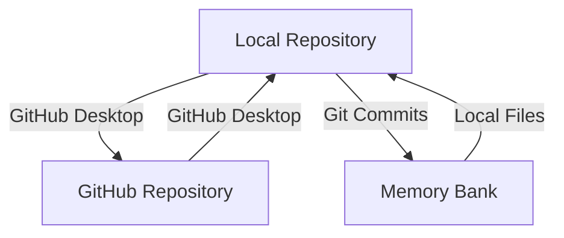

# Memory Bank Local Workflow with GitHub Desktop

## Overview

This document outlines the workflow for using Memory Bank as the exclusive task tracking system while using GitHub Desktop for local Git repository management. This approach eliminates the need for GitHub Projects and reduces dependency on constant internet connectivity.

## Architecture



## Setup Instructions

### 1. GitHub Desktop Setup

1. Install GitHub Desktop (if not already installed)
2. Clone the PerformanceSuite repository:
   - Open GitHub Desktop
   - File > Clone Repository
   - Select the PerformanceSuite repository
   - Choose local path: `/Users/dc/Projects/PerformanceSuite`
   - Click "Clone"

### 2. Disable Unnecessary GitHub Workflows

Since we're moving away from GitHub Projects integration, we should disable the workflows that sync between Memory Bank and GitHub:

1. Disable GitHub Actions workflows:
   - Rename `.github/workflows/sync-memory-bank.yml` to `.github/workflows/sync-memory-bank.yml.disabled`
   - Rename `.github/workflows/project-automation.yml` to `.github/workflows/project-automation.yml.disabled`
   - Rename `.github/workflows/project-automation-graphql.yml` to `.github/workflows/project-automation-graphql.yml.disabled`

2. Commit these changes using GitHub Desktop:
   - Add a summary like "Disable GitHub Projects integration workflows"
   - Commit to main branch
   - Push to origin

### 3. Update Memory Bank Structure

Enhance the Memory Bank structure to better support standalone task tracking:

1. Update `memory-bank/progress.md` to include more detailed task tracking fields
2. Create a new `memory-bank/taskManagement.md` file for comprehensive task tracking

## Daily Workflow

### 1. Task Management

All task management will happen directly in the Memory Bank files:

1. **Creating Tasks**:
   - Add new tasks to `memory-bank/progress.md` under "Current Tasks" or "Next Steps"
   - For detailed task information, add to `memory-bank/taskManagement.md`

2. **Updating Tasks**:
   - Update task status directly in Memory Bank files
   - Move completed tasks to the "Completed Tasks" section

3. **Task Planning**:
   - Use `memory-bank/activeContext.md` for current focus and planning
   - Document decisions in `memory-bank/decisionLog.md`

### 2. Code Management with GitHub Desktop

1. **Regular Commits**:
   - Make frequent, small commits for code changes
   - Include task references in commit messages (e.g., "Implement audio analysis pipeline - Task #3")

2. **Branching Strategy**:
   - Create feature branches for significant development work
   - Use branch naming convention: `feature/short-description`
   - Merge completed features back to main

3. **Synchronization**:
   - Push changes when internet connectivity is available
   - Pull changes before starting new work

### 3. Backup Strategy

1. **Local Backups**:
   - Set up Time Machine or another backup solution for local repository
   - Consider periodic exports of Memory Bank content

2. **Remote Backup**:
   - Push to GitHub when connectivity is available
   - This serves as an off-site backup of both code and Memory Bank

## Transitioning from GitHub Projects

### 1. Export Existing Data

Before fully transitioning away from GitHub Projects:

1. Ensure all current GitHub Issues are reflected in Memory Bank
2. Run the existing sync script one final time:
   ```bash
   python scripts/sync_github_issues_to_memory_bank.py
   ```
3. Review Memory Bank files to ensure all tasks are captured

### 2. Enhanced Memory Bank Task Format

Use a consistent format for tasks in Memory Bank files:

```markdown
* Task Title
  * **ID**: MB-001
  * **Status**: In Progress | Completed | Blocked | Not Started
  * **Priority**: High | Medium | Low
  * **Component**: Audio Analysis | Agent System | Rendering | Infrastructure
  * **Effort**: Large | Medium | Small
  * **Description**: Detailed description of the task
  * **Dependencies**: MB-002, MB-003
  * **Notes**: Additional notes or context
```

## Benefits of This Approach

1. **Reduced Dependency on Internet Connectivity**:
   - All task management happens locally
   - Git operations can be performed offline and synced later

2. **Simplified Workflow**:
   - Single source of truth for tasks (Memory Bank)
   - Direct editing of Markdown files for task management

3. **Better Integration with Development**:
   - Memory Bank files are part of the repository
   - Changes to tasks can be committed alongside code changes

4. **Improved Performance**:
   - No API calls or web interface latency
   - Direct file editing is faster than web interfaces

## Potential Challenges and Solutions

1. **Collaboration Challenges**:
   - **Challenge**: Multiple team members updating the same task files
   - **Solution**: Establish clear ownership areas and communication protocols

2. **Missing GitHub Projects Features**:
   - **Challenge**: Loss of visual board and automation
   - **Solution**: Consider local alternatives like VS Code extensions for Markdown-based task boards

3. **Notification System**:
   - **Challenge**: Loss of GitHub notification system
   - **Solution**: Establish team communication channels for task updates