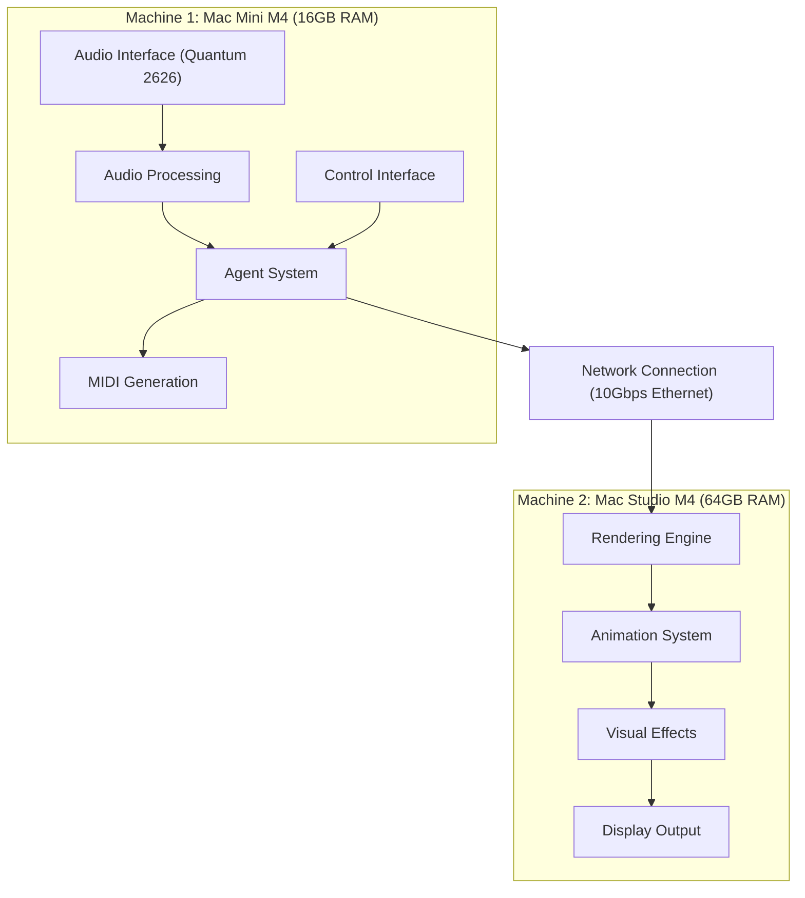

# Performance Suite: Phase 1 Implementation Plan

## Overview

This document outlines the implementation plan for Phase 1 of the Performance Suite project, focusing on establishing the two-machine architecture and developing core prototypes.

## Hardware Architecture

## Machine Roles

### Machine 1 (Mac Mini M4 with 16GB RAM)
- **Primary Role**: Audio Processing & Agent System
- **Components**:
  - Audio Interface (Quantum 2626)
  - Audio Analysis Pipeline
  - Session Manager
  - Bandmate Agents
  - MIDI Generation
  - Control Interface

### Machine 2 (Mac Studio M4 with 64GB RAM)
- **Primary Role**: Rendering & Visual Output
- **Components**:
  - Rendering Engine (Godot/Unity/Unreal)
  - Animation System
  - Visual Effects
  - Display Output

## Machine Connectivity

For sharing keyboard/mouse/display between machines:

1. **Universal Control**: 
   - Apple's built-in feature that allows you to use a single keyboard and mouse across multiple Macs
   - Requires both machines to be signed in to the same Apple ID
   - Works wirelessly or via USB-C connection
   - Setup: System Settings > Displays > Advanced > "Allow your pointer and keyboard to move between any nearby Mac or iPad"

2. **Alternative Options**:
   - Network KVM software like Synergy or Barrier
   - macOS Screen Sharing
   - Hardware KVM switch

## Network Configuration

For optimal performance between the two machines:

1. **Physical Connection**:
   - Connect both machines directly via Ethernet
   - Use 10Gbps Ethernet if available, otherwise 1Gbps

2. **IP Configuration**:
   - Configure static IP addresses:
     - Machine 1 (Mac Mini): 192.168.1.10
     - Machine 2 (Mac Studio): 192.168.1.20

3. **Protocol Configuration**:
   - Primary Protocol: OSC (Open Sound Control) over UDP
   - Port Assignments:
     - 8000: Primary control messages
     - 8001: Animation control
     - 8002: Synchronization messages
     - 8003: Monitoring and status

## Implementation Timeline

| Week | Focus | Key Tasks |
|------|-------|-----------|
| 1-2 | Development Environment Setup | Configure both machines, establish network connectivity, install required software |
| 3-4 | Core Component Implementation | Implement audio analysis pipeline, develop agent system, create MIDI generation |
| 5-6 | Rendering Pipeline & Integration | Set up rendering pipeline, establish OSC communication, integrate components |
| 7-8 | Testing & Refinement | Perform end-to-end testing, optimize performance, complete documentation |

## Detailed Implementation Steps

### 1. Development Environment Setup (Weeks 1-2)

#### Machine 1 (Mac Mini) Setup:
1. **Software Installation**:
   - Python 3.11+: `brew install python@3.11`
   - Anaconda/Miniconda: Download from official website
   - Create virtual environment: `conda create -n performance-suite python=3.11`
   - Activate environment: `conda activate performance-suite`
   - Install required libraries: `pip install -r requirements.txt`
   - Ableton Live (if using for audio output)

2. **Audio Interface Configuration**:
   - Install Quantum 2626 drivers from PreSonus website
   - Configure for low-latency operation:
     - Sample Rate: 96kHz
     - Buffer Size: 32-64 samples
     - Bit Depth: 24-bit
   - Test basic audio input/output

3. **Project Setup**:
   - Clone repository: `git clone https://github.com/yourusername/PerformanceSuite.git`
   - Install project dependencies: `pip install -e .`
   - Configure development environment

#### Machine 2 (Mac Studio) Setup:
1. **Software Installation**:
   - Game engine (Godot/Unity/Unreal)
   - Python 3.11+ (for testing and utilities)
   - Development tools (VSCode, etc.)

2. **Rendering Environment Configuration**:
   - Set up game engine project
   - Configure for high-performance rendering:
     - Target frame rate: 60fps minimum
     - Graphics settings optimized for performance
   - Install necessary plugins/assets

3. **Network Configuration**:
   - Configure static IP (192.168.1.20)
   - Set up OSC listener
   - Test network connectivity with Machine 1

### 2. Basic Audio Analysis Pipeline (Weeks 3-4)

1. **Audio Input Handling**:
   - Enhance `AudioInputHandler` class to support Quantum 2626
   - Implement buffer management for real-time processing
   - Add error handling and recovery mechanisms

2. **Audio Analysis Features**:
   - Implement tempo detection algorithm
   - Develop chord recognition system
   - Create dynamics analysis module
   - Implement basic timbre classification

3. **Testing Framework**:
   - Create unit tests for each analysis component
   - Develop performance benchmarking tools
   - Implement visualization for analysis results

### 3. Simple Agent System Prototype (Weeks 3-4)

1. **Session Manager Implementation**:
   - Enhance `SessionManager` to track musical context
   - Implement agent registration and communication
   - Create event system for inter-component messaging

2. **Bandmate Agents Development**:
   - Implement `DrumsAgent` with basic patterns
   - Create `BassAgent` with simple accompaniment logic
   - Add responsiveness to performer input
   - Implement basic musical decision-making

3. **MIDI Generation System**:
   - Enhance `MidiGenerator` for multiple output channels
   - Implement pattern generation for different instruments
   - Add support for real-time parameter control

### 4. Basic Rendering Pipeline (Weeks 5-6)

1. **OSC Communication**:
   - Enhance `AnimationController` on Machine 1
   - Implement OSC message formatting and sending
   - Create OSC listener on Machine 2
   - Develop message parsing and routing

2. **Animation System**:
   - Create basic avatar models/placeholders
   - Implement animation state machine
   - Develop event-driven animation triggering
   - Add support for blending between animations

3. **Visualization Environment**:
   - Create simple stage environment
   - Implement basic lighting system
   - Develop camera control system
   - Add visual feedback for musical events

### 5. Integration and Testing (Weeks 5-6)

1. **Component Integration**:
   - Connect audio analysis to session manager
   - Link session manager to bandmate agents
   - Connect bandmate agents to MIDI generation
   - Link animation controller to rendering system

2. **Performance Measurement**:
   - Implement latency measurement tools
   - Create CPU and memory usage monitoring
   - Develop network performance analysis

3. **Optimization**:
   - Identify and address performance bottlenecks
   - Optimize critical paths for low latency
   - Implement efficient data structures and algorithms

### 6. Refinement and Documentation (Weeks 7-8)

1. **Issue Resolution**:
   - Address bugs and performance issues
   - Implement error handling and recovery
   - Add logging and diagnostics

2. **Documentation**:
   - Update technical specifications
   - Create user setup guide
   - Document API and interfaces
   - Add inline code documentation

3. **Phase 2 Preparation**:
   - Identify lessons learned
   - Plan improvements for Phase 2
   - Create backlog of enhancement requests

## Testing Procedures

### Component Testing
- Test each component individually on its respective machine
- Validate functionality against requirements
- Measure performance metrics (CPU usage, memory, latency)

### Integration Testing
- Test communication between machines
- Validate end-to-end functionality
- Measure system-wide latency

### Performance Testing
- Conduct stress tests to identify bottlenecks
- Optimize critical paths
- Establish performance baselines

## Success Criteria

Phase 1 will be considered successful when:

1. Development environment is set up and documented
2. Audio analysis pipeline can process real-time audio input
3. Agent system prototype demonstrates basic functionality
4. Rendering pipeline can display simple animations
5. End-to-end latency is within acceptable limits (<50ms for Phase 1)
6. System can run stably for at least 30 minutes

## Next Steps After Phase 1

1. Evaluate Phase 1 results against success criteria
2. Identify areas for improvement
3. Begin planning for Phase 2 implementation
4. Consider additional MCP server integration opportunities