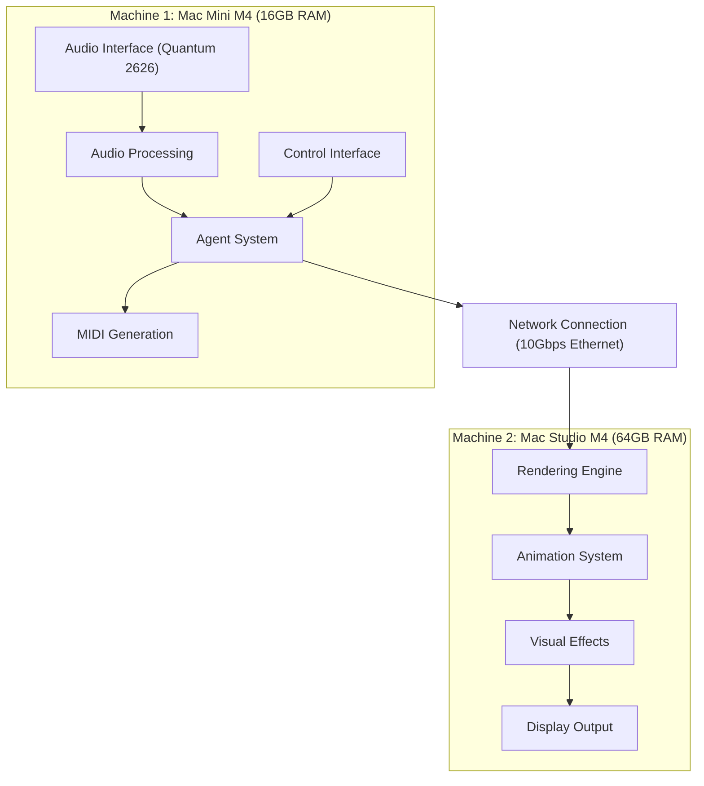
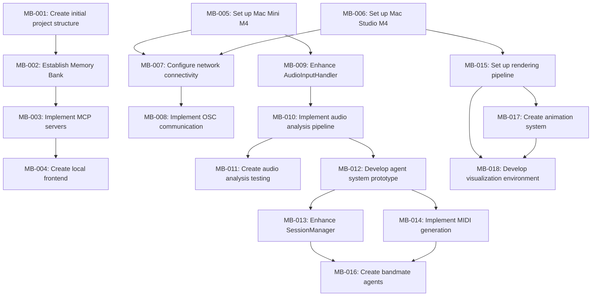

# Performance Suite: Project Planning Summary

## Overview

This document provides a comprehensive overview of the Performance Suite project planning, including the project phases, task organization, and implementation timeline. It serves as a guide to understanding how the project is structured and how tasks are prioritized.

## Project Structure

The Performance Suite project is organized into the following phases:

1. **Phase 0: Project Setup** - Initial infrastructure and environment setup
2. **Phase 1: Development Environment** - Configure machines and establish connectivity
3. **Phase 2: Core Components** - Implement basic functionality for each system
4. **Phase 3: Integration** - Connect components across machines
4. **Phase 4: Testing & Refinement** - Optimize performance and fix issues
5. **Phase 5: Future Enhancements** - Additional features and improvements

## Hardware Architecture

## Implementation Timeline

| Phase | Focus | Key Tasks |
|------|-------|-----------|
| 0 | Project Setup | Create project structure, establish Memory Bank, implement MCP servers |
| 1 | Development Environment | Configure both machines, establish network connectivity, set up OSC communication |
| 2 | Core Components | Implement audio analysis pipeline, develop agent system, create MIDI generation, set up rendering pipeline |
| 3 | Integration | Create bandmate agents, develop animation system, build visualization environment |
| 4 | Testing & Refinement | Perform end-to-end testing, optimize performance, complete documentation |
| 5 | Future Enhancements | Add advanced features, improve user interface, enhance visual effects |

## Task Organization

Tasks are organized by phase and component. Each task has the following attributes:

- **ID**: Unique identifier (MB-XXX)
- **Title**: Brief description of the task
- **Status**: Not Started, In Progress, Blocked, or Completed
- **Priority**: High, Medium, or Low
- **Component**: Audio Analysis, Agent System, Rendering, or Infrastructure
- **Effort**: Large, Medium, or Small
- **Description**: Detailed description of the task
- **Dependencies**: Other tasks that must be completed first
- **Notes**: Additional context or information

## Current Progress

### Completed Tasks
- MB-001: Create initial project structure
- MB-002: Establish Memory Bank for project documentation
- MB-003: Implement MCP servers for task management and GitHub Desktop

### Next Steps
1. **Phase 1: Development Environment**
   - MB-005: Set up Mac Mini M4 for audio processing
   - MB-006: Set up Mac Studio M4 for rendering
   - MB-007: Configure network connectivity between machines
   - MB-008: Implement OSC communication

2. **Phase 2: Core Components**
   - MB-009: Enhance AudioInputHandler for Quantum 2626
   - MB-010: Implement basic audio analysis pipeline
   - MB-012: Develop simple agent system prototype
   - MB-015: Set up basic rendering pipeline

## Task Dependencies

## Dashboard and Visualization

The project includes a dashboard for visualizing tasks and project progress. The dashboard provides:

1. **Project Overview**: High-level statistics about task completion
2. **Task Board**: Kanban-style view of tasks by status
3. **System Architecture**: Interactive diagram of system components
4. **Gantt Timeline**: Visual representation of task scheduling
5. **Component Progress**: Progress tracking by system component
6. **Task Details**: Detailed information about selected tasks

## Task Management Tools

The project uses the following tools for task management:

1. **Memory Bank**: Central repository for project documentation
2. **Task Management MCP**: MCP server for managing tasks programmatically
3. **Dashboard**: Web-based visualization of project status and tasks

## Conclusion

This project planning summary provides a comprehensive overview of the Performance Suite project structure, phases, and task organization. It serves as a guide for understanding the project's implementation plan and tracking progress toward completion.

Last Updated: 2025-04-17