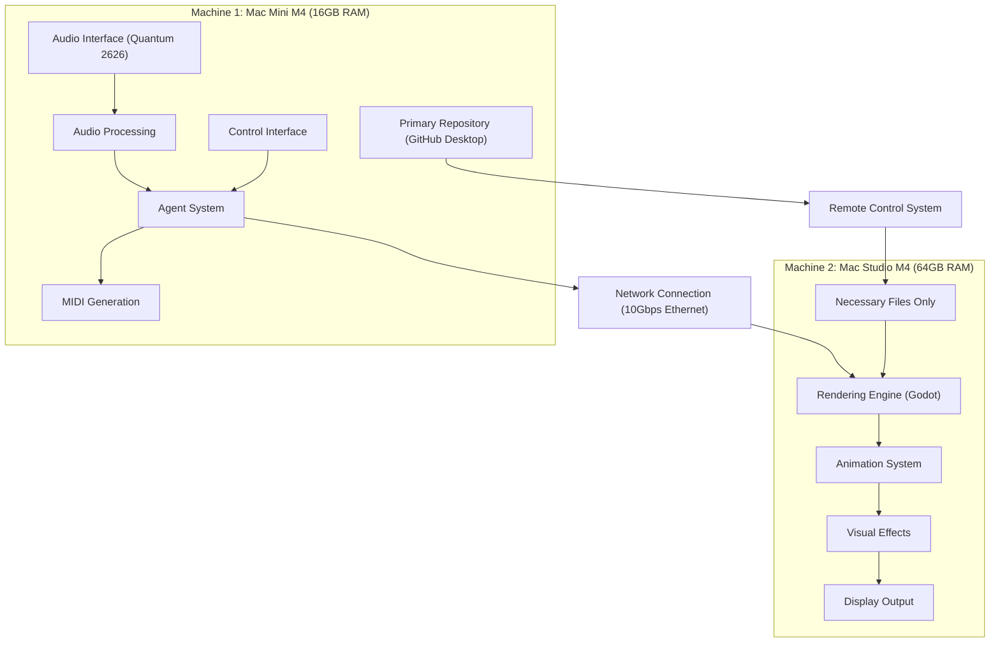

# Performance Suite: Updated Environment Setup Guide

## Overview

This guide provides step-by-step instructions for setting up the two-machine environment for the Performance Suite project. It addresses the specific roles of each machine and the repository management strategy.

## Hardware Architecture



## Machine Roles

### Machine 1 (Mac Mini M4 with 16GB RAM)
- **Primary Role**: Audio Processing, Agent System, and Primary Development Machine
- **Components**:
  - Audio Interface (Quantum 2626)
  - Audio Analysis Pipeline
  - Session Manager
  - Bandmate Agents
  - MIDI Generation
  - Control Interface
  - Primary Repository (GitHub Desktop)

### Machine 2 (Mac Studio M4 with 64GB RAM)
- **Primary Role**: Rendering & Visual Output
- **Components**:
  - Rendering Engine (Godot)
  - Animation System
  - Visual Effects
  - Display Output
  - Necessary files only (transferred from Mac Mini)

## Repository Management Strategy

- **Primary Development on Mac Mini**: The Mac Mini serves as the primary development machine with the main repository managed through GitHub Desktop.
- **Mac Studio as Rendering Node**: The Mac Studio functions as a specialized rendering node that receives only the necessary files from the Mac Mini.
- **File Transfer**: Use the remote control system to transfer required files to the Mac Studio as needed.
- **Single Source of Truth**: Maintain a single source of truth (the repository on the Mac Mini) to avoid synchronization issues.

## Network Configuration

### Step 1: Physical Connection
1. Connect both machines directly using an Ethernet cable
2. Ensure both machines are powered on

### Step 2: Configure Static IP Addresses

#### On Machine 1 (Mac Mini):
1. Open System Settings > Network
2. Select the Ethernet connection
3. Click "Details..."
4. Change from "Using DHCP" to "Manually"
5. Set the following:
   - IP Address: 192.168.1.10
   - Subnet Mask: 255.255.255.0
   - Router: 192.168.1.1 (if needed)
6. Click "OK" to save changes

#### On Machine 2 (Mac Studio):
1. Open System Settings > Network
2. Select the Ethernet connection
3. Click "Details..."
4. Change from "Using DHCP" to "Manually"
5. Set the following:
   - IP Address: 192.168.1.20
   - Subnet Mask: 255.255.255.0
   - Router: 192.168.1.1 (if needed)
6. Click "OK" to save changes

### Step 3: Verify Connection
1. On Machine 1, open Terminal and run:
   ```
   ping 192.168.1.20
   ```
2. On Machine 2, open Terminal and run:
   ```
   ping 192.168.1.10
   ```
3. Both should show successful ping responses with low latency (<1ms)

## Keyboard/Mouse/Display Sharing Setup

### Option 1: Universal Control (Recommended)

#### Prerequisites:
- Both Macs must be signed in to the same Apple ID
- Both Macs must have Bluetooth, Wi-Fi, and Handoff turned on
- Both Macs must be running macOS Monterey or later

#### Setup:
1. On both machines, go to System Settings > Displays > Advanced
2. Enable "Allow your pointer and keyboard to move between any nearby Mac or iPad"
3. On the same screen, ensure "Push through the edge of a display to connect a nearby Mac or iPad" is enabled
4. Position your displays in the arrangement you prefer
5. Move your cursor to the edge of one display to seamlessly transition to the other Mac

### Option 2: Barrier (Alternative)

If Universal Control doesn't work well for your setup, you can use Barrier, an open-source software KVM:

#### Installation:
1. Download Barrier from https://github.com/debauchee/barrier/releases for both machines
2. Install on both machines

#### Configuration:
1. On your primary machine (where keyboard/mouse are physically connected):
   - Launch Barrier
   - Select "Server (share this computer's mouse and keyboard)"
   - Configure the screen arrangement
   - Start the server
   
2. On your secondary machine:
   - Launch Barrier
   - Select "Client (use another computer's mouse and keyboard)"
   - Enter the server's IP address (e.g., 192.168.1.10)
   - Start the client

## Software Environment Setup

### Machine 1 (Mac Mini) Setup:

1. **Install Homebrew** (if not already installed):
   ```bash
   /bin/bash -c "$(curl -fsSL https://raw.githubusercontent.com/Homebrew/install/HEAD/install.sh)"
   ```

2. **Install Python 3.11**:
   ```bash
   brew install python@3.11
   ```

3. **Install Miniconda**:
   ```bash
   brew install --cask miniconda
   ```

4. **Initialize conda**:
   ```bash
   conda init zsh  # or bash if you use bash
   ```

5. **Create virtual environment**:
   ```bash
   conda create -n performance-suite python=3.11
   conda activate performance-suite
   ```

6. **Install GitHub Desktop**:
   ```bash
   brew install --cask github
   ```

7. **Set up repository with GitHub Desktop**:
   - Open GitHub Desktop
   - Choose "Create a New Repository" or "Clone a Repository from the Internet"
   - For a new repository:
     - Name: PerformanceSuite
     - Local Path: /Users/yourusername/Projects/PerformanceSuite
     - Initialize with README: Yes
     - Git Ignore: Python
     - License: MIT
   - For cloning an existing repository:
     - URL: Your repository URL or browse GitHub repositories
     - Local Path: /Users/yourusername/Projects/PerformanceSuite

8. **Install project dependencies**:
   ```bash
   cd /Users/yourusername/Projects/PerformanceSuite
   pip install -r requirements.txt
   pip install -e .
   ```

9. **Configure Audio Interface**:
   - Install PreSonus Universal Control software from the PreSonus website
   - Connect the Quantum 2626 via Thunderbolt
   - Open Universal Control and configure:
     - Sample Rate: 96kHz
     - Buffer Size: 32-64 samples
     - Bit Depth: 24-bit

10. **Install paramiko for remote control**:
    ```bash
    pip install paramiko
    ```

### Machine 2 (Mac Studio) Setup:

1. **Install Homebrew** (if not already installed):
   ```bash
   /bin/bash -c "$(curl -fsSL https://raw.githubusercontent.com/Homebrew/install/HEAD/install.sh)"
   ```

2. **Install Python 3.11**:
   ```bash
   brew install python@3.11
   ```

3. **Install minimal dependencies**:
   ```bash
   pip install python-osc paramiko
   ```

4. **Configure Godot**:
   - Ensure Godot is installed
   - Configure for high-performance rendering:
     - Target frame rate: 60fps minimum
     - Graphics settings optimized for performance
   - Create a new project directory:
     ```bash
     mkdir -p ~/PerformanceSuite/godot_project
     ```

5. **Create project directory structure**:
   ```bash
   mkdir -p ~/PerformanceSuite/scripts
   mkdir -p ~/PerformanceSuite/src
   ```

## Remote Control Setup

### Setting Up Remote Control

1. **Enable Remote Login on Mac Studio**:
   - On the Mac Studio, go to System Settings > Sharing
   - Enable "Remote Login" to allow SSH access

2. **Set up SSH key-based authentication** (optional but recommended):
   - On the Mac Mini, generate an SSH key pair:
     ```bash
     ssh-keygen -t ed25519 -C "mac-mini-to-mac-studio"
     ```
   - Copy the public key to the Mac Studio:
     ```bash
     ssh-copy-id username@192.168.1.20
     ```
   - Create an SSH config file for easier access:
     ```bash
     echo "Host mac-studio
       HostName 192.168.1.20
       User yourusername
       IdentityFile ~/.ssh/id_ed25519" >> ~/.ssh/config
     ```

3. **Install Required Dependencies**:
   ```bash
   pip install paramiko  # For SSH functionality
   ```

4. **Start the Remote Control Server on Machine 2 (Mac Studio)**:
   ```bash
   # On the Mac Studio
   cd ~/PerformanceSuite
   python scripts/remote_control_mcp.py --port 5000
   ```

5. **Start the Remote Control Client on Machine 1 (Mac Mini)**:
   ```bash
   # On the Mac Mini
   cd /Users/yourusername/Projects/PerformanceSuite
   python scripts/remote_control_client.py
   ```

6. **Using Remote Control with Roo**:
   Once the server and client are running, you can use the following MCP tools in Roo:

   - Execute a command on the Mac Studio:
     ```
     remote_execute:
       command: "python3 scripts/test_osc_receiver.py --port 5000"
     ```

   - Transfer a file to the Mac Studio:
     ```
     remote_transfer:
       source: "src/config.py"
       destination: "src/config.py"
       direction: "send"
     ```

   - Get system status from the Mac Studio:
     ```
     remote_status:
       type: "system"  # or "network"
     ```

## Testing the Setup

1. **Test Network Communication**:
   - On Machine 1, run the OSC test script:
     ```bash
     python scripts/test_osc_sender.py --ip 192.168.1.20 --port 5000
     ```
   - On Machine 2, run the OSC receiver script:
     ```bash
     python scripts/test_osc_receiver.py --port 5000
     ```
   - Verify messages are being received with minimal latency

2. **Test Keyboard/Mouse Sharing**:
   - Move your cursor to the edge of the screen to transition between machines
   - Verify that keyboard input works on both machines

3. **Test Audio Interface**:
   - Play audio through the Quantum 2626
   - Run the audio analysis test script:
     ```bash
     python scripts/test_audio_analysis.py
     ```
   - Verify that audio is being properly captured and analyzed

4. **Test Remote Control**:
   - On the Mac Mini, run:
     ```bash
     python scripts/test_remote_control.py
     ```
   - This will test the connection to the Mac Studio and verify that the remote control server is working

## Troubleshooting

### Network Issues:
- Ensure both machines have the correct static IP configuration
- Try a different Ethernet cable
- Check network settings for any firewall issues

### Universal Control Issues:
- Ensure both machines are signed in to the same Apple ID
- Verify Bluetooth and Wi-Fi are enabled on both machines
- Restart both machines

### Audio Interface Issues:
- Update to the latest PreSonus drivers
- Try different buffer size settings
- Check Thunderbolt connection

### Remote Control Issues:
- Verify that the remote control server is running on the Mac Studio
- Check that the correct IP address and port are being used
- Ensure that SSH access is enabled on the Mac Studio
- Verify that the necessary Python packages are installed on both machines

## Next Steps

Once your environment is set up, you can proceed with:
1. Implementing the audio analysis pipeline
2. Developing the agent system
3. Setting up the rendering pipeline
4. Integrating all components

Refer to the Phase 1 Implementation Plan for detailed steps on each of these components.