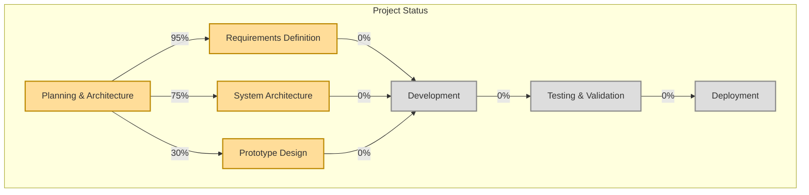

# Progress: Performance Suite

## Current Status

The Performance Suite project is in the **initial planning and architecture phase**. The following represents the current status of various project components:

## What Works

The project is in the initial development phase. The following foundational elements have been established:

1. **Comprehensive Technical Specification**: Detailed technical requirements including:
   - Specific latency budgets (sub-10ms end-to-end)
   - Detailed hardware specifications for both machines
   - MCP server integration architecture
   - Network configuration and protocols
   - Error handling and recovery procedures
   - Testing methodologies and performance benchmarks

2. **Project Vision and Goals**: Defined in the project brief and product context documents
3. **Detailed Architecture**: Two-machine design with specialized components and MCP server integration
4. **Technical Requirements**: Precise latency constraints and system requirements
5. **Memory Bank**: Comprehensive documentation structure for project knowledge management
6. **GitHub Repository**: Set up with issue templates, PR template, CI workflow, and contributing guidelines
7. **GitHub Projects**: Configured with custom fields, views, automation workflows, and milestone tracking
8. **Development Environment**: Basic project structure with core components implemented
9. **Component Prototypes**: Initial implementations of:
   - Audio Analysis: Basic feature extraction from audio input
   - Agent System: Session manager and bandmate agents (drums, bass)
   - MIDI Generation: Conversion of agent output to MIDI messages
   - Animation Control: Communication with rendering machine

## What's Left to Build

The entire system implementation is pending. Major components to be built include:

### Machine 1: Processing & Audio
- [x] Audio Analysis Agent
- [ ] Session Manager Agent
- [ ] Control Interface Agent
- [ ] Bandmate Agents (Drums, Bass, etc.)
- [ ] MIDI Generation Agent
- [ ] Animation Control Agent
- [ ] Stage Visuals Agent (Optional)
- [ ] Ableton Live Integration

### Machine 2: Rendering
- [ ] OSC/WebSocket Listener
- [ ] Scene Manager
- [ ] Avatar Loader
- [ ] Animation State Machine/Player
- [ ] Shape Key Controller
- [ ] Real-time Renderer

### MCP Servers (Optional)
- [ ] Animation Control Server
- [ ] Musical AI Server

### Cross-Cutting Concerns
- [ ] Inter-Machine Communication Protocol
- [ ] Configuration System
- [ ] Performance Monitoring
- [ ] Testing Framework
- [ ] Deployment Pipeline
- [ ] MCP Server Integration

## Implementation Timeline

The project is in the initial planning phase, and a detailed implementation timeline has not yet been established. A preliminary roadmap is as follows:

1. **Phase 1: Core Architecture and Prototypes** (Timeline TBD)
   - Establish development environment
   - Implement basic audio analysis pipeline
   - Create simple agent system prototype
   - Set up basic rendering pipeline

2. **Phase 2: Component Development** (Timeline TBD)
   - Implement individual agents
   - Develop rendering system
   - Create animation control system
   - Establish inter-machine communication

3. **Phase 3: Integration and Optimization** (Timeline TBD)
   - Integrate all components
   - Optimize for latency and performance
   - Implement configuration system
   - Develop monitoring and debugging tools

4. **Phase 4: Testing and Refinement** (Timeline TBD)
   - Comprehensive testing
   - User experience refinement
   - Performance tuning
   - Documentation completion

5. **Phase 5: MCP Server Integration** (Timeline TBD)
   - Develop Animation Control Server
   - Develop Musical AI Server
   - Integrate with main system
   - Test and optimize MCP server performance

## Known Issues

As the project is in the planning phase, there are no implementation issues yet. However, several technical challenges and risks have been identified:

1. **Latency Management**: Achieving the required end-to-end latency of <10ms across multiple processing stages
2. **Inter-Machine Synchronization**: Ensuring tight synchronization between audio and visual elements
3. **Resource Constraints**: Balancing computational demands with available resources
4. **Integration Complexity**: Managing the integration of multiple specialized components
5. **MCP Server Performance**: Ensuring MCP servers meet the sub-1ms processing time requirements
6. **Graceful Degradation**: Implementing effective fallback mechanisms for all system components

## Evolution of Project Decisions

### [2025-04-15] GitHub Project Management Setup
- Configured GitHub Projects with custom fields (Priority, Component, Effort)
- Created multiple project views (Board, Roadmap, Component, Priority)
- Set up project automation workflows for issue and PR management
- Added milestone tracking and synchronization
- Created additional issue templates for technical debt and performance optimization

### [2025-04-15] Comprehensive Technical Specification Integration
- Incorporated detailed technical specification with specific performance requirements
- Added MCP server integration to the architecture
- Established precise latency budgets for all system components
- Defined detailed testing procedures and performance benchmarks

### Initial Architectural Decisions
- Two-machine architecture to separate processing and rendering concerns
- Agent-based design for modularity and specialization
- OSC/WebSocket for inter-machine communication
- Ableton Live as the sound generation engine
- Game engine for visual rendering

## Next Milestones

1. **Complete System Architecture**: Finalize component relationships and interfaces
2. **Development Environment Setup**: Establish toolchain and workflow
3. **Initial Prototype**: Develop proof-of-concept for core functionality
4. **Testing Framework**: Create benchmarking and validation tools
5. **MCP Server Prototype**: Develop initial MCP server implementation
2025-04-15 18:45:57 - Pushed project restructuring changes to GitHub
2025-04-15 20:01:28 - Enhanced GitHub repository with project management features
