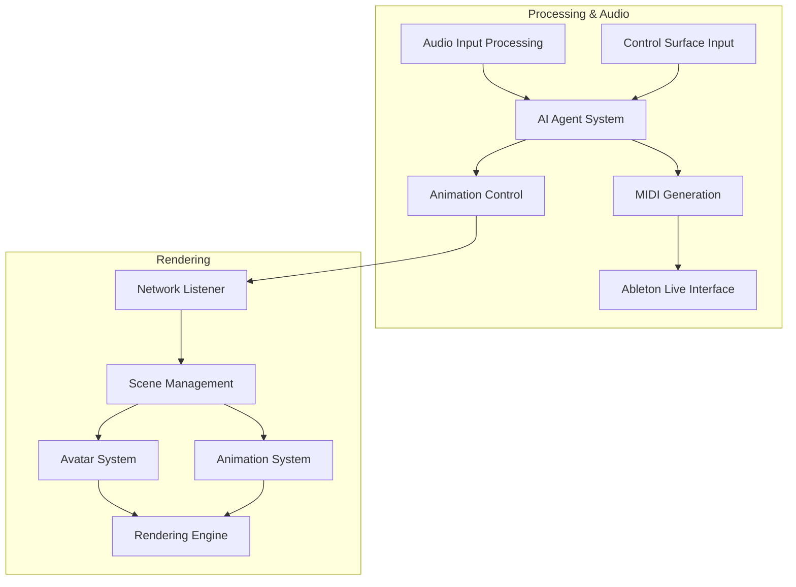

# System Patterns: Performance Suite

## System Architecture

The Performance Suite follows a distributed architecture split across two machines:



### Machine 1: Processing & Audio
- Handles all real-time audio processing and analysis
- Runs the AI agent system for musical decision-making
- Generates MIDI data to control Ableton Live
- Sends animation control data to Machine 2
- Manages performer input (audio and control surfaces)

### Machine 2: Rendering
- Dedicated to visual rendering tasks
- Receives animation control data from Machine 1
- Manages 3D avatars and their animations
- Renders the visual output for display
- Handles visual effects and scene management

## Key Technical Decisions

1. **Agent-Based Architecture**:
   - Multiple specialized agents with distinct responsibilities
   - Centralized Session Manager for coordination
   - Event-driven communication between agents

2. **OSC/WebSocket Communication**:
   - Open Sound Control (OSC) for low-latency musical control
   - WebSockets for more complex data structures when latency is less critical
   - Standardized message formats for interoperability

3. **Ableton Live Integration**:
   - AbletonOSC for reliable communication with Ableton
   - MIDI mapping for direct control of instruments and effects
   - Audio routing through professional audio interface

4. **Game Engine Rendering**:
   - Godot/Unity/Unreal for high-quality real-time rendering
   - GLSL/HLSL shaders for custom visual effects
   - Optimized for performance on dedicated rendering hardware

5. **Modular Component Design**:
   - Loosely coupled components with well-defined interfaces
   - Plug-and-play architecture for different agent types
   - Configurable system to adapt to different performance needs

## Design Patterns

1. **Observer Pattern**:
   - Used for event notification between agents
   - Session Manager observes all agent activities
   - Allows for reactive behavior based on system events

2. **Strategy Pattern**:
   - Different musical generation strategies based on context
   - Swappable animation strategies for different visual styles
   - Configurable processing strategies for different audio inputs

3. **Factory Pattern**:
   - Dynamic creation of agent instances
   - Runtime generation of musical patterns
   - Creation of visual elements based on performance context

4. **Command Pattern**:
   - Encapsulation of performer instructions
   - Queueable commands for timing-sensitive operations
   - Undoable operations for rehearsal scenarios

5. **State Machine**:
   - Management of performance states (intro, verse, chorus, etc.)
   - Animation state management for avatars
   - System mode transitions (setup, rehearsal, performance)

## Component Relationships

### Audio Analysis Chain:
```
Audio Input → Signal Processing → Feature Extraction → Musical Context Analysis → Agent Decision Making
```

### Control Flow:
```
Performer Input → Control Interface Agent → Session Manager → Bandmate Agents → MIDI Generation → Ableton Live
```

### Animation Pipeline:
```
Musical Events → Animation Control Agent → OSC/WebSocket → Rendering Machine → Avatar Animation System → Display
```

## Critical Implementation Paths

1. **Audio Analysis Path**:
   - Critical for responsive musical interaction
   - Must maintain sub-50ms latency from input to analysis results
   - Requires efficient signal processing algorithms

2. **MIDI Generation Path**:
   - Translates agent decisions into playable MIDI
   - Must synchronize precisely with tempo and musical structure
   - Requires robust error handling to prevent performance disruption

3. **Inter-Machine Communication**:
   - Must maintain reliable, low-latency connection between machines
   - Requires efficient serialization of complex animation data
   - Needs fault tolerance for network hiccups

4. **Rendering Pipeline**:
   - Must maintain consistent frame rate for smooth visual experience
   - Requires optimization for real-time performance
   - Needs synchronization with audio events for convincing performance
