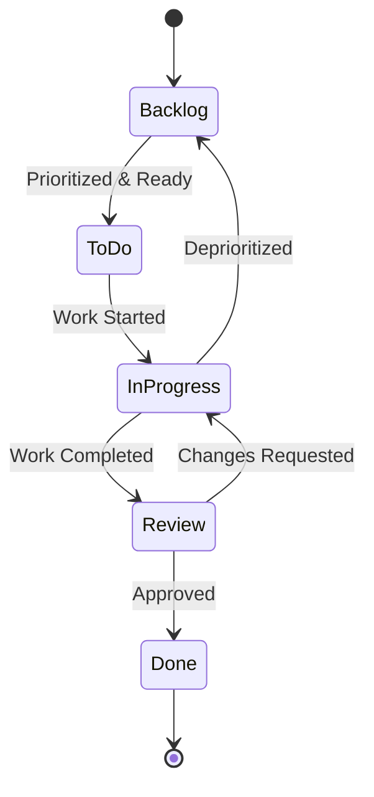

# Task Management: Performance Suite

## GitHub Project Structure

The Performance Suite project will use GitHub Projects for task management and progress tracking. The project board structure will be organized as follows:

```mermaid
graph TD
    subgraph GitHub Repository
        Issues[Issues]
        PRs[Pull Requests]
        Actions[GitHub Actions]
        Projects[GitHub Projects]
    end
    
    subgraph Project Board
        Backlog[Backlog]
        ToDo[To Do]
        InProgress[In Progress]
        Review[Review]
        Done[Done]
    end
    
    subgraph Issue Types
        Feature[Feature Request]
        Bug[Bug Report]
        Refactor[Refactoring]
        Doc[Documentation]
        Research[Research Spike]
    end
    
    Issues --> Project Board
    PRs --> Review
```

### Board Columns

1. **Backlog**:
   - Captured ideas and tasks not yet ready for implementation
   - Needs refinement before moving to To Do
   - May contain tasks for future milestones

2. **To Do**:
   - Fully specified tasks ready for implementation
   - Prioritized according to current milestone goals
   - Contains all tasks planned for current sprint

3. **In Progress**:
   - Tasks actively being worked on
   - Limited to avoid context switching (typically 1-2 per developer)
   - Should include link to branch/PR if applicable

4. **Review**:
   - Tasks completed and awaiting review
   - Includes code review, documentation review, or design review
   - May require testing or validation before approval

5. **Done**:
   - Tasks that have been completed and approved
   - All acceptance criteria met
   - Documentation updated as needed

## Current Sprint/Milestone Focus

The project is in the initial planning phase. The first milestone is focused on establishing the project foundation.

### Initial Milestone: Project Foundation

**Objective**: Establish project foundation and architecture

**Key Deliverables**:
- ✅ Complete system architecture documentation
- ✅ Memory Bank setup with comprehensive documentation
- ✅ GitHub repository setup with templates and workflows
- ✅ Development environment setup
- ✅ Initial prototype design
- ✅ GitHub Projects board setup

**Timeline**: Q2 2025

### Next Milestone: Core Functionality

**Objective**: Implement core functionality and create working prototypes

**Key Deliverables**:
- ⬜ Audio analysis pipeline implementation
- ⬜ Agent system with basic musical response
- ⬜ MIDI generation for Ableton Live control
- ⬜ Inter-machine communication protocol
- ⬜ Basic avatar animation control

**Timeline**: Q3 2025

## Task Prioritization Framework

Tasks will be prioritized using the following framework:

### Priority Levels

1. **P0: Critical**
   - Blocking issues preventing project progress
   - Core functionality essential for system operation
   - Immediate attention required

2. **P1: High**
   - Important features for upcoming milestone
   - Significant bugs affecting system functionality
   - Required for demo or review

3. **P2: Medium**
   - Standard feature implementation
   - Non-blocking bugs
   - Improvements to existing functionality

4. **P3: Low**
   - Nice-to-have features
   - Minor improvements
   - Documentation updates

### Effort Estimation

Tasks will be estimated using T-shirt sizing:

- **XS**: < 4 hours
- **S**: 4-8 hours (1 day)
- **M**: 1-3 days
- **L**: 3-5 days
- **XL**: 5-10 days
- **XXL**: > 10 days (should be broken down)

### Prioritization Matrix

```
┌─────────────┬───────────────────────────────────────────┐
│             │               IMPORTANCE                  │
│             ├───────────────┬───────────────────────────┤
│             │     High      │           Low             │
├─────────────┼───────────────┼───────────────────────────┤
│     High    │ Do First      │ Schedule for              │
│ URGENCY     │ (P0, P1)      │ specific time (P2)        │
├─────────────┼───────────────┼───────────────────────────┤
│     Low     │ Schedule for  │ Do when time              │
│             │ near term (P2)│ permits (P3)              │
└─────────────┴───────────────┴───────────────────────────┘
```

## Issue Template Patterns

The following issue templates will be used to standardize task creation:

### Feature Request Template

```markdown
## Feature Description
[Brief description of the feature]

## User Story
As a [user type], I want [goal] so that [benefit].

## Acceptance Criteria
- [ ] Criterion 1
- [ ] Criterion 2
- [ ] Criterion 3

## Technical Considerations
[Any technical details, constraints, or considerations]

## Dependencies
[Any dependencies on other issues or components]

## Additional Context
[Any additional information, mockups, or references]
```

### Bug Report Template

```markdown
## Bug Description
[Clear and concise description of the bug]

## Steps to Reproduce
1. [First Step]
2. [Second Step]
3. [and so on...]

## Expected Behavior
[What you expected to happen]

## Actual Behavior
[What actually happened]

## Environment
- OS: [e.g. macOS 12.0]
- Hardware: [e.g. Mac Mini M4]
- Component Version: [e.g. Audio Analysis Agent v0.2]

## Possible Solution
[Optional: Any ideas for how to fix the bug]

## Additional Context
[Any other context, logs, or screenshots]
```

### Research Spike Template

```markdown
## Research Question
[The main question or topic to investigate]

## Objectives
- [ ] Objective 1
- [ ] Objective 2
- [ ] Objective 3

## Expected Outcomes
[What information or decisions should result from this research]

## Timeframe
[Expected duration for the research]

## Resources
[Any resources, references, or starting points]

## Documentation Requirements
[How the findings should be documented]
```

## PR Review Process

The pull request process will follow these steps:

1. **Creation**:
   - Link PR to related issue(s)
   - Fill out PR template with description of changes
   - Assign reviewers (at least one required)

2. **Review**:
   - Code review by assigned reviewers
   - Automated checks via GitHub Actions
   - Testing verification if applicable

3. **Revision**:
   - Address feedback from reviewers
   - Update PR as needed
   - Request re-review when ready

4. **Approval**:
   - Require at least one approval before merging
   - All automated checks must pass
   - All review comments must be resolved

5. **Merge**:
   - Squash and merge to keep history clean
   - Delete branch after merging
   - Close related issues automatically

### PR Template

```markdown
## Description
[Brief description of the changes]

## Related Issue(s)
[Link to related issue(s)]

## Type of Change
- [ ] Bug fix
- [ ] New feature
- [ ] Breaking change
- [ ] Documentation update
- [ ] Refactoring
- [ ] Performance improvement

## Testing Performed
- [ ] Unit tests
- [ ] Integration tests
- [ ] Manual testing

## Checklist
- [ ] My code follows the project's style guidelines
- [ ] I have commented my code, particularly in hard-to-understand areas
- [ ] I have updated the documentation accordingly
- [ ] My changes generate no new warnings
- [ ] I have added tests that prove my fix is effective or that my feature works
- [ ] New and existing tests pass locally with my changes
```

## Task State Transitions

Tasks will follow this state transition flow:



### Transition Criteria

1. **Backlog → To Do**:
   - Task is fully specified with clear acceptance criteria
   - All dependencies are resolved or scheduled
   - Task is prioritized for current milestone
   - Resources are available to complete the task

2. **To Do → In Progress**:
   - Developer has capacity to work on the task
   - All blockers have been resolved
   - Task is started with a corresponding branch if applicable

3. **In Progress → Review**:
   - Implementation is complete
   - All acceptance criteria are met
   - Tests are written and passing
   - Documentation is updated
   - PR is created and ready for review

4. **Review → In Progress**:
   - Changes requested during review
   - Additional work needed to meet acceptance criteria
   - Issues found during testing

5. **Review → Done**:
   - All reviews are approved
   - All tests are passing
   - PR is merged
   - Related issues are closed

## Task Completion Criteria

For a task to be considered complete, it must meet the following criteria:

### General Completion Criteria

1. All acceptance criteria defined in the issue are met
2. Code follows project coding standards and best practices
3. Appropriate tests are written and passing
4. Documentation is updated to reflect changes
5. PR is approved and merged
6. No regressions are introduced

### Component-Specific Criteria

#### Audio Processing Components
- Latency requirements are met and verified
- Audio quality is maintained
- Resource usage is within acceptable limits

#### Agent System Components
- Agent behavior matches design specifications
- Inter-agent communication works as expected
- Error handling is robust

#### Visual Components
- Animations are smooth and synchronized with audio
- Visual quality meets design standards
- Frame rate requirements are met

#### Integration Components
- Communication between machines is reliable
- System handles network issues gracefully
- End-to-end functionality works as expected
