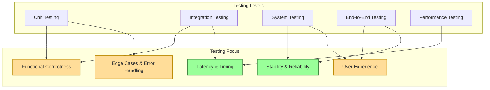
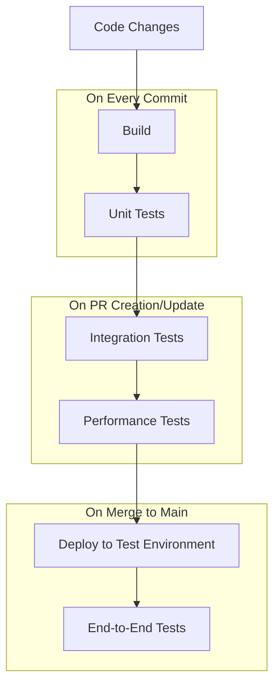

# Testing Strategy: Performance Suite

## Testing Philosophy & Approach

The Performance Suite testing strategy is built on the following core principles:

1. **Performance-First Testing**: Given the real-time nature of the system, performance testing is a first-class concern, not an afterthought.

2. **Multi-Level Testing**: Testing occurs at multiple levels, from unit tests of individual components to end-to-end tests of the complete system.

3. **Continuous Testing**: Tests are integrated into the development workflow and CI/CD pipeline, providing immediate feedback.

4. **User-Centered Validation**: Testing includes both objective metrics and subjective evaluation of the user experience.

5. **Test-Driven Development**: Where appropriate, tests are written before implementation to clarify requirements and guide development.

## Test Coverage Requirements

### Overall Coverage Targets

- **Core Components**: 90%+ code coverage
- **Agent Logic**: 85%+ code coverage
- **UI/Control Components**: 75%+ code coverage
- **Integration Points**: 100% coverage of critical paths

### Critical Areas Requiring Comprehensive Testing

1. **Audio Analysis Pipeline**: Must be thoroughly tested for accuracy and performance
2. **Agent Decision Making**: Must be tested for musical coherence and responsiveness
3. **Inter-Machine Communication**: Must be tested for reliability and fault tolerance
4. **Real-Time Synchronization**: Must be tested for timing accuracy and stability

### Coverage Measurement

- Code coverage will be measured using appropriate tools for each language (e.g., pytest-cov for Python, gcov for C++)
- Coverage reports will be generated as part of the CI/CD pipeline
- Coverage trends will be tracked over time to identify areas needing attention

## Unit Testing Patterns

### Component-Specific Testing Approaches

#### Audio Analysis Components

- **Input Simulation**: Test with pre-recorded audio samples with known characteristics
- **Feature Extraction Validation**: Compare extracted features against ground truth
- **Performance Benchmarking**: Measure processing time for various input types
- **Edge Case Handling**: Test with extreme inputs (silence, noise, complex polyphony)

#### Agent System Components

- **State Machine Testing**: Verify correct state transitions based on inputs
- **Decision Logic Testing**: Test decision-making with various musical contexts
- **Mock Integration**: Use mock objects for dependencies to isolate testing
- **Deterministic Testing**: Ensure reproducible behavior with fixed random seeds

#### Communication Components

- **Protocol Conformance**: Verify message format adherence
- **Serialization Testing**: Test encoding/decoding of complex data structures
- **Error Handling**: Test response to malformed messages and connection issues
- **Timing Tests**: Verify message delivery within latency constraints

### Test Doubles Strategy

- **Mocks**: Used for external dependencies and complex interactions
- **Stubs**: Used for providing test-specific responses
- **Fakes**: Simplified implementations for complex components
- **Spies**: Used to verify interaction patterns between components

## Integration Testing Protocols

### Integration Test Scope

1. **Agent Interaction Tests**: Verify correct communication between agents
2. **Audio Pipeline Tests**: Test complete audio analysis and response chain
3. **Machine Communication Tests**: Verify correct data flow between machines
4. **Ableton Integration Tests**: Test MIDI generation and Ableton control

### Integration Testing Approach

- **Component Pairing**: Test pairs of interacting components before full integration
- **Incremental Integration**: Add components one by one to identify integration issues
- **Interface Contract Testing**: Verify components adhere to defined interfaces
- **Configuration Testing**: Test with various system configurations

### Integration Test Environments

- **Development Environment**: Local testing with simulated inputs
- **Staging Environment**: Testing with actual hardware but controlled inputs
- **Production-Like Environment**: Testing with full hardware setup

## End-to-End Testing Scenarios

### Core User Journeys

1. **Basic Performance Scenario**:
   - Performer plays instrument
   - System analyzes audio and generates appropriate accompaniment
   - Visual avatars animate in sync with generated music
   - System responds to changes in performer's playing

2. **Control Interface Scenario**:
   - Performer uses control surface to direct virtual bandmates
   - System interprets commands and adjusts musical behavior
   - Visual feedback confirms command reception
   - Musical output reflects the requested changes

3. **Recovery Scenario**:
   - System encounters unexpected input or internal error
   - Error handling mechanisms activate
   - System recovers to stable state
   - Performance continues with minimal disruption

### Test Automation vs. Manual Testing

- **Automated Tests**: Basic functionality, regression testing, performance metrics
- **Manual Tests**: User experience evaluation, subjective quality assessment, exploratory testing
- **Hybrid Approach**: Automated tests with manual verification of critical aspects

## Test Data Management

### Test Data Types

1. **Audio Samples**: Pre-recorded audio clips with various musical characteristics
2. **MIDI Patterns**: Reference patterns for comparison with generated output
3. **Musical Contexts**: Defined musical scenarios (e.g., chord progressions, rhythmic patterns)
4. **Control Sequences**: Simulated performer control inputs
5. **Network Conditions**: Simulated network scenarios for testing communication

### Test Data Organization

- **Test Data Repository**: Centralized storage for all test data
- **Versioning**: Test data versioned alongside code
- **Metadata**: Detailed descriptions of test data characteristics
- **Generation Scripts**: Tools for generating synthetic test data

### Test Data Access

- **Local Cache**: Test data available locally for development
- **CI/CD Integration**: Test data accessible to automated test pipelines
- **Data Subsets**: Smaller datasets for quick tests, comprehensive sets for thorough testing

## Test Automation Workflows

### CI/CD Integration

### Automated Test Execution

- **Pre-Commit Hooks**: Run fast tests before allowing commits
- **Pull Request Validation**: Run comprehensive tests on PR creation/update
- **Scheduled Tests**: Run full test suite on a regular schedule
- **Manual Triggers**: Allow manual execution of specific test suites

### Test Result Reporting

- **Test Dashboard**: Central view of test status across the system
- **Trend Analysis**: Track test metrics over time
- **Failure Analysis**: Tools for diagnosing and categorizing test failures
- **Performance Metrics**: Visualization of performance test results

## Quality Gates & Criteria

### Development Phase Gates

1. **Implementation Start**:
   - Requirements are testable
   - Test plan is defined
   - Test data is available

2. **Code Review**:
   - Unit tests are written and passing
   - Code coverage meets targets
   - Performance benchmarks are defined

3. **Feature Complete**:
   - Integration tests are passing
   - Performance tests meet requirements
   - Documentation is updated

### Release Quality Gates

1. **Alpha Release**:
   - All unit and integration tests pass
   - Known issues are documented
   - Basic end-to-end functionality works

2. **Beta Release**:
   - All automated tests pass
   - Performance meets minimum requirements
   - System is stable under normal conditions

3. **Production Release**:
   - All tests pass consistently
   - Performance meets target requirements
   - System is stable under stress conditions
   - User acceptance testing is complete

### Continuous Quality Metrics

- **Test Pass Rate**: Percentage of passing tests over time
- **Defect Density**: Number of defects per unit of code
- **Performance Trends**: Key performance metrics over time
- **Technical Debt**: Tracking of test gaps and quality issues

## Specialized Testing Approaches

### Latency Testing

- **End-to-End Latency**: Measure time from input to output
- **Component Latency**: Measure processing time of individual components
- **Latency Profiling**: Identify bottlenecks in the processing chain
- **Jitter Analysis**: Measure variability in processing time

#### Latency Measurement Methodology
- **Audio Testing**: Loopback test from output to input with waveform analysis
- **Visual Testing**: High-speed camera capture of visual reaction to audio event
- **End-to-End Testing**: Click-to-flash test with measurement of elapsed time
- **MCP Server Testing**: Round-trip time measurement for server requests

### Reliability Testing

- **Long-Running Tests**: Verify stability over extended periods
- **Chaos Testing**: Introduce random failures to test recovery
- **Resource Limitation Tests**: Test behavior under resource constraints
- **Fault Injection**: Deliberately introduce faults to test error handling
- **MCP Server Failover**: Test automatic switching to backup servers
- **Degraded Mode Operation**: Verify graceful degradation through all levels

### User Experience Testing

- **Subjective Evaluation**: Expert assessment of musical quality
- **Blind Comparison**: Compare system output with human performances
- **Usability Testing**: Evaluate ease of use for performers
- **Audience Perception**: Assess audience reaction to performances

## Pre-Performance Testing Procedures

1. **System Boot Test**: Verify correct startup sequence including MCP servers
2. **MCP Server Test**: Verify MCP server responsiveness and correct operation
3. **Audio Pathway Test**: Verify audio signal integrity
4. **Visual Rendering Test**: Verify visual output quality and frame rate
5. **Animation Quality Test**: Verify MCP-driven animation quality and responsiveness
6. **Network Test**: Verify connection speed and packet transit times including MCP communication
7. **End-to-End Latency Test**: Measure total system response time
8. **MCP Failover Test**: Verify graceful degradation when MCP servers are unavailable
9. **Resource Headroom Test**: Verify sufficient system resources

## Performance Benchmarks

- **Audio Processing**: <3ms for full audio chain
- **Visual Rendering**: Stable 60fps minimum
- **Network Transit**: <1ms packet transit time
- **MCP Server Processing**: <1ms for animation calculations
- **MCP Network Round-trip**: <2ms for complete request-response cycle
- **Overall Responsiveness**: <10ms from input to output
