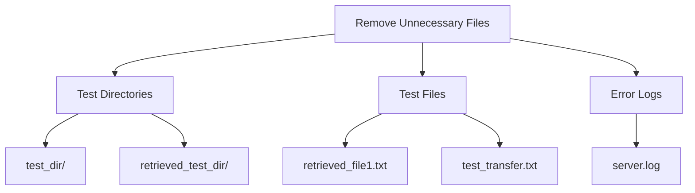
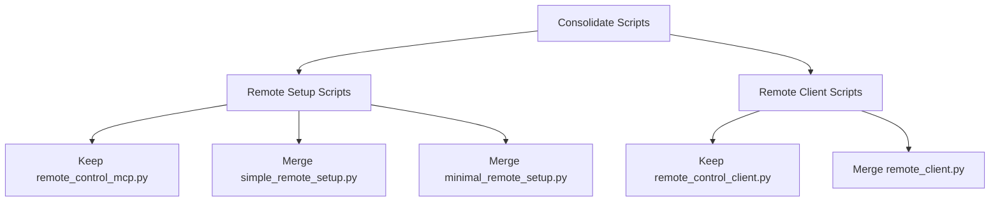
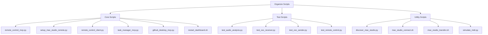
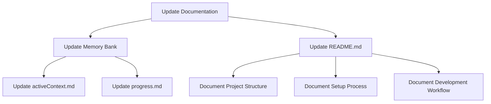
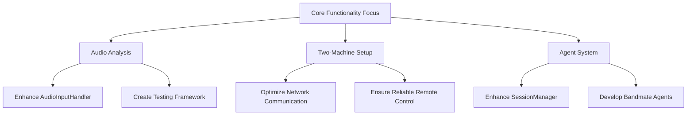

# Project Cleanup and Refocus Plan

This document outlines the steps to clean up the PerformanceSuite project and ensure we're on track with the core functionality.

## 1. Remove Unnecessary Test Files and Directories



### Files to Remove:
- `test_dir/` directory and its contents
- `retrieved_test_dir/` directory and its contents
- `retrieved_file1.txt` (test file)
- `test_transfer.txt` (test file for SCP transfer)
- `server.log` (error log for a missing server.py file)

## 2. Consolidate Redundant Scripts



### Scripts to Consolidate:
1. **Remote Setup Scripts**:
   - Keep `setup_mac_studio_remote.py` as the main setup script
   - Merge functionality from `simple_remote_setup.py` and `minimal_remote_setup.py`
   - Document the consolidated script

2. **Remote Client Scripts**:
   - Keep `remote_control_client.py` as the main client (more feature-rich MCP client)
   - Remove `remote_client.py` (simpler version with less functionality)

## 3. Organize Scripts Directory



### Script Organization:
- Create README.md in the scripts directory explaining the purpose of each script
- Group scripts by functionality in the README

## 4. Update Project Documentation



### Documentation Updates:
1. **Memory Bank Updates**:
   - Update `activeContext.md` to reflect the cleanup and current focus
   - Update `progress.md` to mark completed tasks and add the cleanup task

2. **README.md Updates**:
   - Ensure the main README.md clearly explains the project structure
   - Document the two-machine setup process
   - Document the development workflow

## 5. Focus on Core Functionality



### Core Functionality Priorities:
1. **Audio Analysis**:
   - Enhance `AudioInputHandler` for Quantum 2626 (optimize buffer size for <10ms latency)
   - Create audio analysis testing framework

2. **Two-Machine Setup**:
   - Ensure reliable communication between Mac Mini and Mac Studio
   - Optimize network settings for low-latency OSC communication

3. **Agent System**:
   - Enhance `SessionManager` implementation
   - Develop basic bandmate agents

## 6. Implementation Steps

1. **Cleanup Phase**:
   ```bash
   # Remove test directories and files
   rm -rf test_dir/ retrieved_test_dir/
   rm retrieved_file1.txt test_transfer.txt server.log
   
   # Consolidate scripts
   # (This will be done in the Code mode)
   ```

2. **Documentation Phase**:
   ```bash
   # Update Memory Bank
   # (This will be done in the Code mode)
   ```

3. **Core Functionality Phase**:
   ```bash
   # Focus on enhancing AudioInputHandler
   # Create audio analysis testing framework
   # Enhance SessionManager
   # (This will be done in the Code mode)
   ```

## 7. Success Criteria

- Project directory is clean and well-organized
- Documentation is up-to-date and reflects the current state
- Core functionality is working reliably
- Two-machine setup is stable and performant
- Audio analysis pipeline is optimized for low latency